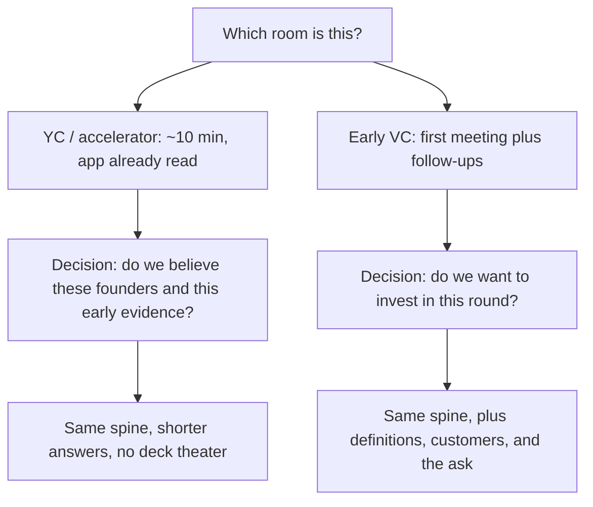

# Interview formats (YC vs VC diligence)
{: .no_toc }

*~8 min read*

**Interview occasional**

## Why it matters

The same company story fails in different ways in different rooms. A 12-slide seed deck wastes a YC interview. A one-line accelerator answer wastes a seed partner meeting that was supposed to underwrite a round. Prep the room you are actually walking into. The questions overlap. The clock, the artifact, and the decision do not.

## Core concepts

- **YC (and most accelerator interviews) are short and already informed.** Plan on about 10 minutes with two or three partners who have read the application. They interrupt. They are deciding whether these founders understand their own company and can be trusted with a batch, not whether a deck is pretty. Public YC talks (Dalton Caldwell on applying, Michael Seibel on pitching) describe this as a conversation that punishes throat-clearing.
- **What they pull on.** What the company does, in concrete language. Who the user is. What a real user did. How you make money. Any number you put in the application. Why this team. They will pick the weakest sentence and stay there. A polished overview that never gets interrupted is usually a sign you talked too long to be tested.
- **Early VC diligence is a process, not a slot.** A first meeting (often half an hour to an hour) plus follow-ups: metric definitions, a customer or two, how the round is coming together. The decision is whether to invest in this round. They still want the same spine — why this, why now, why you, product, market, traction, competition, go-to-market, team, ask — and they have time to check the definitions.
- **Artifacts.** YC: the application and your mouth. A deck on screen is usually a mistake in that room. Seed: a short deck is normal, and the appendix that matters is the metric definition plus one customer story. Bring the deck. Be ready to abandon it in the first minute if they start firing questions.
- **Pace.** In the short room, answer the question that was asked, then stop. Let them pull the next thread. In the longer room, a two-minute narrative (what it is, who it's for, the proof, the ask) and then questions. Filibustering fails both.
- **Honesty scales across both.** If a number is a pilot, a LOI, or "founder-sold," say that before they ask. The short room finds out by arithmetic. The long room finds out in diligence. See [Common traps](../12-common-traps-weak-answers/).

## Mental model

Name the room before you rehearse. Then rehearse the answer length that room can hold.

## Interview questions

1. **A partner interrupts your second sentence with "who is the user?" What do you do?**
   Answer: Answer that question. One specific user, what they do, and the last time the problem showed up. Then stop. Going back to finish the overview tells them you can't be redirected. The overview can wait; the user cannot. See [Problem clarity](../03-problem-clarity-customer-stories/).

2. **How should your prep differ between a YC interview and a seed partner meeting?**
   Answer: Same facts, different packaging. For YC, drill 10 minutes with interruptions and no slides: one-sentence product, one customer, the numbers in your application, how you make money, the cofounder story. For the seed meeting, add a short narrative, a deck you can skip, the metric definition, and a clear ask. The seed follow-up will ask you to prove what YC only had time to poke.

3. **You have a 12-slide deck. Do you screen-share it in a YC interview?**
   Answer: No. They have the application. Screen-sharing spends the only minutes you have on slides they can read later. If a number is easier to say than to show, say it. If they ask to see something, then show that thing.

4. **An associate says "walk me through the deck," and the partner meeting is next week. What is that meeting for?**
   Answer: It is a filter and a prep session for the partner meeting. Give the two-minute version, then let them pull. Offer the definition of your main metric and one customer they could call. Don't treat the associate as a practice pitch you can burn. Their notes are the brief the partner reads.

## Watch

- [How to Apply and Succeed at Y Combinator by Dalton Caldwell](https://www.youtube.com/watch?v=8yiOcCPvyNE) — Y Combinator. What the application and interview are actually for, including the founder video and the cost of not following the instructions.
- [Tips on How to Get into the BEST Startup Accelerator in the World - Y Combinator](https://www.youtube.com/watch?v=-4Jyiz58sp4) — Justin Kan. A former YC partner on who the batch is for and how to think about applying, from the founder side.

## Further reading

- [How to Pitch Your Company](https://www.ycombinator.com/library/4b-how-to-pitch-your-company) — YC Startup Library. The short oral pitch, which is the artifact the accelerator room wants.
- [How to Raise Money](https://paulgraham.com/fr.html) — Paul Graham. How a raise actually feels, which is the seed-meeting context the 10-minute interview is not.
- [Writing a Business Plan](https://www.sequoiacap.com/article/writing-a-business-plan/) — Sequoia Capital. The classic outline of the story a longer diligence process expects. Use it as a checklist of topics, not as a 40-page document.
