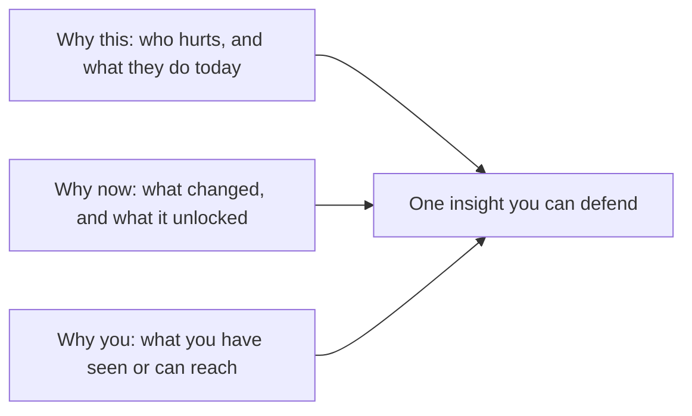

# Why this / why now / why you
{: .no_toc }

*~9 min read*

**🎯 Interview frequent**

## Why it matters

These are three questions. Founders answer them with one word: passion. Partners hear that as "we have no mechanism." Why this is the pain. Why now is the change that makes the company possible this year. Why you is the reason this team sees it and can reach it. A strong answer has one fact under each. A weak answer has adjectives under all three.

## Core concepts

- **Why this.** Someone already pays to make the problem go away — in money, hours, or a bad workaround (a spreadsheet, a group chat, an intern, a tool they hate). Kevin Hale's public test is useful here: the problem is easier to believe when it is frequent, urgent, expensive, or newly mandatory. "People would like this" is not a why-this.
- **Why now.** Name a change and what it unlocked. Cost of a technical ingredient collapsed. A regulation created a buyer. A behavior moved (teams already live in the tool you plug into). "AI is hot" is a wave, not a why-now, unless you can say which workflow just became cheap enough or good enough to replace the workaround. If the idea was equally possible five years ago, say what you know now that founders then did not.
- **Why you.** Founder-market fit: you have lived the problem, you can build the thing, or you can reach the user faster than a smart outsider. "We're Penn students and we work hard" is a work ethic. It becomes an edge only if the user is one you can actually get to — a campus buyer, a lab, a community you're in — or you have a skill the product needs. An insight is a belief a smart person would argue with, tied to something you saw.
- **You need one real advantage, not five slogans.** Hale's lecture frames unfair advantages as founder insight, a market that's growing, a product that is obviously much better on one axis, a cheap way to reach users, or a path to a monopoly. One that is true beats a slide with all five claimed.
- **How the two rooms weight them.** A YC interview will spend the scarce minutes on why-you and on whether you have met the user. An early VC has more time to underwrite why-now, because the round only works if the window is real. Prepare all three anyway. See [Market size & wedge](../05-market-size-wedge/) for the "now" that is just a big market, and [Team](../10-team-equity-roles/) for the "you" that is really a cofounder question.

## Mental model

If you remove any box and the company story still sounds the same, that box was empty.

## Interview questions

1. **Why are you the team to build this?**
   Answer: A specific edge, not a résumé tour. "I ran this workflow for two years and the tool we used dropped the handoff between X and Y" or "we can ship the model, and the first ten users are people who already reply to us." Then one sentence on the cofounder who covers the part you don't. Hard work and a relevant major are context. They are not the edge.

2. **Why now? Why not five years ago, and why not five years from now?**
   Answer: Name the change and the consequence. Example shape: "Invoice volume in this segment moved into a system with an API in the last two years, so a workflow that used to require an implementation team is now a product." If your honest answer is "we only just noticed," say what you noticed and why the user is ready this year. Don't borrow a trend you can't connect to the buyer's calendar.

3. **A partner says "this sounds like a lifestyle business, not a startup." What are they actually asking?**
   Answer: Whether there is a path from this painful, narrow problem to a company that can get large. Answer with the wedge and the next adjacent user, not with ambition. "The first buyer is X, there are enough of them to matter, and the same pain shows up in Y once the workflow exists." See [Market size & wedge](../05-market-size-wedge/). Passion does not answer this.

4. **How is "why this" different from your product description?**
   Answer: Why-this is the user's situation before you exist. The product is what you chose to build in response. Start with the situation: who, how often, what it costs, what they do today. Then the product, in one sentence. Founders who start with the product usually cannot say why anyone switches.

## Watch

- [Kevin Hale - How to Evaluate Startup Ideas](https://www.youtube.com/watch?v=DOtCl5PU8F0) — Y Combinator. A startup idea as a hypothesis: problem, solution, and the insight that could make it grow. This is the cleanest public version of why-this and why-you.
- [How To Change The World? Get The Small Things Right – Dalton Caldwell and Michael Seibel](https://www.youtube.com/watch?v=qnav9vgHDHs) — Y Combinator. On doing the unglamorous research that produces a real why-you, instead of a surface-level idea.

## Further reading

- [How to Get Startup Ideas](https://paulgraham.com/startupideas.html) — Paul Graham. Start from a problem you know, and be suspicious of ideas that arrived as ideas.
- [Organic Startup Ideas](https://paulgraham.com/organic.html) — Paul Graham. The version of why-you that comes from needing the thing yourself.
- [Schlep Blindness](https://paulgraham.com/schlep.html) — Paul Graham. Why good ideas often look like unpleasant work other people are avoiding.
- [What makes great founders stand out?](https://www.ycombinator.com/library/64-what-makes-great-founders-stand-out) — Michael Seibel, YC Startup Library. Execution, communication, and staying motivated. The "why you" partners can see in the room.
