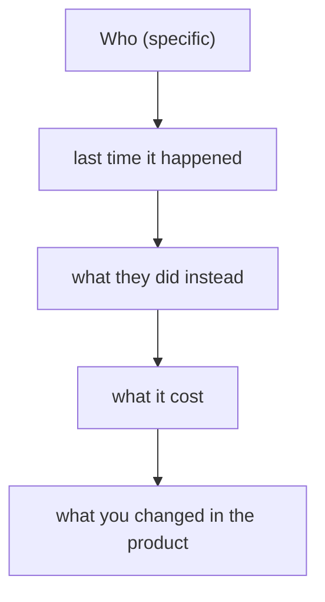

# Problem clarity & customer stories
{: .no_toc }

*~8 min read*

**🎯 Interview frequent**

## Why it matters

YC interviews often turn into "tell me about a user" within the first minute. Early VC diligence turns into "can we talk to one." A category description ("SMBs struggle with ops") is not a story. A story has a person, a last time, a workaround, and a cost. If you cannot tell one, partners assume you have not earned the idea yet.

## Core concepts

- **One user, one job, one moment.** Who they are (role, context), the last time the problem happened, what they did, what it cost, what they had already tried. Five sentences. A persona slide with demographics is not this.
- **Past behavior, not hypothetical love.** "Would you use this?" produces polite yeses. "Walk me through the last time you did this" produces evidence. Rob Fitzpatrick's *The Mom Test* is the short version: talk about their life, not your idea. Ask for specifics. Don't pitch in the first half of the conversation.
- **The workaround is the competitor you forgot.** Excel, a WhatsApp thread, a VA, a module of a tool they already pay for, or doing nothing. Name it. "They don't have a solution" is rarely true. "They hate the solution and still use it" is a story.
- **User, buyer, and champion are different jobs in B2B.** The person in pain may not have budget. Say who feels it, who signs, and who can block. If you only know the user, say that. See [Go-to-market](../08-go-to-market-story/).
- **A count without a change is a vanity metric.** "We talked to 30 people" matters when you can say what you believed before, what they said, and what you cut or built because of it. Three conversations that changed the product beat thirty that confirmed the pitch.
- **What each room does with the story.** In a YC interview, one vivid customer is often the whole answer, and they will ask a follow-up you can only answer if you were actually there ("what did she say when you showed her the price?"). In seed diligence, expect to introduce that customer, so the story has to be true and the person has to be willing to talk.

## Mental model

If you skip "last time," you are pitching. If you skip "what you changed," you are collecting anecdotes.

## Interview questions

1. **Tell me about a real user.**
   Answer: Name the context even if you don't name the person. "A facilities manager at a 40-person school; last month she rebuilt the schedule in a spreadsheet after the vendor export dropped two rooms; it took her four hours; she still renewed the vendor because switching was worse." Then one sentence on what she is using from you, or why she hasn't yet. Stop. Let them pull.

2. **How many customers have you talked to, and what did you learn?**
   Answer: The number, who they were (so it isn't friends being nice), and one belief you changed. "Twelve clinic office managers, not our classmates. We thought the pain was billing codes. It was the prior-auth PDF. We cut the dashboard and shipped the PDF path." A number with no change reads as tourism.

3. **Everyone you talk to says they love the idea. Why isn't that enough?**
   Answer: Liking an idea is cheap. Using a workaround, paying, or giving you a recurring slot on their calendar is not. Report behavior: they paid, they showed up again, they introduced a peer, or they didn't. Love in a user interview is the thing *The Mom Test* tells you to discount.

4. **Your user and your buyer are different people. How do you explain that without it sounding like you have no customer?**
   Answer: Say both, and say which one you have evidence on. "Nurses hit the problem every shift. The director of nursing buys. We've watched four nurses do the workaround and we've had two buying conversations, one of which turned into a pilot." Hiding the split is worse than naming it.

## Watch

- [Eric Migicovsky - How to Talk to Users](https://www.youtube.com/watch?v=MT4Ig2uqjTc) — Y Combinator. The practical version: who to talk to, questions that aren't pitches, and writing down what you heard.
- [How To Talk To Users \| Startup School](https://www.youtube.com/watch?v=z1iF1c8w5Lg) — Y Combinator, Gustaf Alströmer. How to get the conversation, and how not to bias it by introducing the idea too early.

## Further reading

- Rob Fitzpatrick, *The Mom Test*. The rule set behind "ask about their life, not your idea." [momtestbook.com](https://www.momtestbook.com/)
- [Do Things that Don't Scale](https://paulgraham.com/ds.html) — Paul Graham. The early customer conversation is manual on purpose.
- [Successful Founders Are OK With Rejection – Dalton Caldwell and Michael Seibel](https://www.youtube.com/watch?v=zB_SkaERWZY) — Y Combinator. Why avoiding the conversation protects your ego and kills the company. (Video, listed here because it is the mindset half of this page.)
