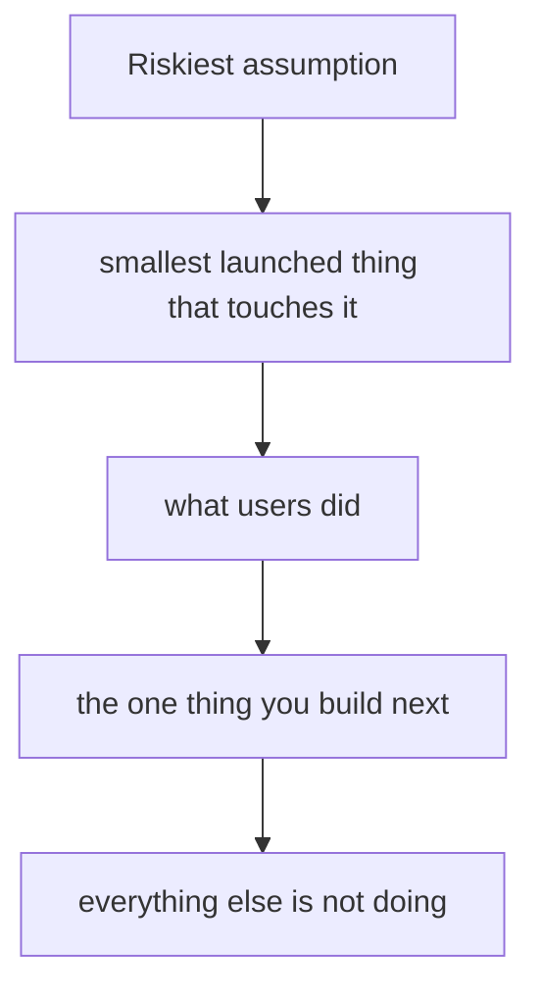

# Product sense & prioritization
{: .no_toc }

*~8 min read*

**Interview occasional**

## Why it matters

"What do you do?" shows up in almost every founder interview, and it is usually over in a minute. The occasional deeper pass is prioritization: what you built, what you cut, and why that order. Partners are listening for whether the product is a bet on a specific user risk, or a tour of everything the company might someday be.

## Core concepts

- **Two sentences, then an example.** Michael Seibel's public pitch standard: say what it does in plain language, then a specific scene. "Airbnb lets a host rent a room. They take a fee when it books. A waiter in D.C. with a spare room during inauguration week." "A platform that leverages AI to transform workflows" fails this test. See [Common traps](../12-common-traps-weak-answers/).
- **The MVP is a test you launched, not a smaller vision.** Seibel's Startup School version: time-box it, write the spec, cut the spec, and don't fall in love with v1. If it has been "almost ready" for a semester, the product decision is the delay. The riskiest assumption should be the thing v1 touches. Everything else can be manual.
- **Prioritize in the room with three lists.** Now (what users can do today). Next (the one thing evidence says to build). Not doing (a plausible feature you killed, and the user reason). A roadmap of twelve items tells them you have not chosen.
- **Better on one axis the user already cares about.** Faster, cheaper, or newly possible for a job they do this week. A feature list is not 10x. If you can't say the axis, you are describing activity.
- **YC vs seed on product.** The accelerator room wants proof you shipped and learned. A seed meeting will also ask whether the wedge product is the seed of the larger product, or a dead-end demo. You should know which features exist only to reach the first user, and which ones the bigger company needs. See [Market size & wedge](../05-market-size-wedge/).

## Mental model

The interview answer is that chain, not the feature inventory.

## Interview questions

1. **What does the product do?**
   Answer: Two sentences a non-expert can picture, plus one example with a person in it. Then stop. If they want the technology, they will ask. Starting with the model, the architecture, or the vision is how founders hide that the product is vague.

2. **What did you decide not to build, and why?**
   Answer: One real cut. "We didn't build the admin dashboard. The first users were the managers themselves, and a shared inbox was enough. We'll build permissions when a second seat at the same company is the thing blocking a deal." The why should cite a user or a deadline, not taste.

3. **You've been building for four months and you haven't launched. How do you talk about that?**
   Answer: Say what's in the way in one sentence, then the date you will put it in front of a user and what you will learn. "The integration needs their test tenant; we get it Tuesday; the test is whether they complete a real prior auth that week." A longer defense of quality sounds like fear. Seibel's line is the right standard: launch something narrow, then iterate with users.

4. **A partner asks how this becomes a big product, not a feature.**
   Answer: Separate v1 from the path. "V1 replaces this one step in the workflow for this buyer. The same buyer has three adjacent steps that are the same data. We are not building those until the first step is used every week." That is a product sequence. "We'll become the operating system for the industry" is a wish.

## Watch

- [Michael Seibel - How to Plan an MVP](https://www.youtube.com/watch?v=1hHMwLxN6EM) — Y Combinator. Time-box, write the spec, cut it, launch, and don't fall in love with the first version.
- [Secrets You Can Learn From Your Customers](https://www.youtube.com/watch?v=IdwYMfM2QMs) — Y Combinator, Michael Seibel and Dalton Caldwell. How sitting with users changes what you build, with Airbnb and Brex as the cases.

## Further reading

- [How to plan an MVP](https://www.ycombinator.com/library/6f-how-to-plan-an-mvp) — Michael Seibel, YC Startup Library. The same lecture, in text, if you want the checklist without the video.
- [Do Things that Don't Scale](https://paulgraham.com/ds.html) — Paul Graham. Manual product work is a legitimate v1.
