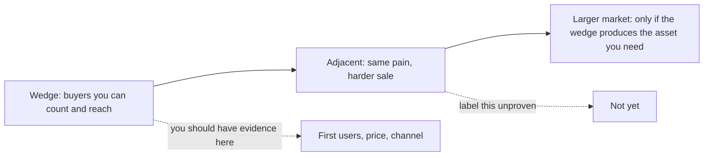

# Market size & wedge
{: .no_toc }

*~9 min read*

**🎯 Interview frequent**

## Why it matters

"How big is the market?" is one of the questions founders answer with a number they found after they picked the idea. Partners can hear that. The answer they can use has two parts: a first market you can count, and a reason that market is a wedge into a larger one. YC will punish a fake TAM in a single follow-up. A seed investor still needs the larger story, because a round has to have a way to matter. Give both, and label which step you have evidence for.

## Core concepts

- **Bottom-up first.** Count the buyers you have a path to, times what they pay, times how often. "There are about 4,000 firms of this type in the US, the tool they replace is about $8k a year, and we've seen two budgets at that level." That can be checked. "$50 billion industry, we'll get 1%" cannot.
- **The wedge is a market, not a demographic.** A beachhead has buyers, a budget or a habit, a way they talk to each other, and a way you can reach them. "Gen Z" is not a wedge. "Club sports treasurers at schools that already use this payments stack" might be. Peter Thiel's lecture is the canonical version: Facebook started with one campus, Amazon with books. The small market was the point, because they could win it.
- **Say the expansion as a sequence of adjacencies, and mark the unproven step.** Wedge → next user who shares the workflow → broader market. "We start with independent clinics. Hospital systems are the same prior-auth pain and a different sale. We have not sold a hospital." Partners trust the sentence that admits the gap.
- **A growing market is a tailwind, not a plan.** "The category is growing 20% a year" is nice context in Hale's framework. It does not replace a wedge. A shrinking or flat budget is a real objection; answer it with who still has the pain and the budget, or admit the timing is bad.
- **Skip the acronym stack unless you can define it.** TAM / SAM / SOM are fine when each layer is a real filter (who has the problem, who you can reach, who you can win first). Reciting three round numbers you cannot derive is worse than one bottom-up count.
- **Room difference.** In the short YC interview, lead with the wedge count and one sentence of expansion. In seed diligence, be ready to show the filter: what's excluded, why the price is believable, and what has to be true for the second market. See [Fundraising narrative](../11-fundraising-narrative-ask/).

## Mental model

Win a market you can name. Describe the next one as a hypothesis.

## Interview questions

1. **How big is the market?**
   Answer: Bottom-up, then the wedge, then one expansion sentence. "About 4,000 buyers, ~$8k a year, so low tens of millions for the beachhead if you won all of it, which we won't. The reason to care is that the workflow data is the same one hospital groups already pay more for. We're not in that sale yet." If you only have the big number, you don't have an answer yet.

2. **Isn't this too small?**
   Answer: Say why the small market is the right first one, in Thiel's sense: you can be the default there, and winning it gives you the asset (distribution, data, a workflow) the next market requires. Then say what "too small" would actually look like — if the beachhead cannot support a real price or cannot lead anywhere. Don't inflate the count to escape the question.

3. **Where did that TAM come from?**
   Answer: Walk the arithmetic out loud. Source, what's included, what's excluded, and the assumption you are least sure of. "The 4,000 is from the association directory, filtered to firms with at least one office manager. The $8k is the incumbent's list price, and we've only seen two actual contracts. The price is the weak part." Invented precision is a trap. A sourced range is an answer. See [Common traps](../12-common-traps-weak-answers/).

4. **A seed partner says the wedge is interesting and the big market is hand-waving. What do you concede?**
   Answer: Concede the unproven step by name, and say what evidence would promote it from story to plan. "Hospital expansion is a hypothesis. The evidence we owe you is one design partner and a repeated workflow, not a TAM slide. The round is sized to get the wedge to retained revenue, not to enter hospitals." That is fundable honesty. Pretending you have the second market is not.

## Watch

- [Competition is for Losers with Peter Thiel (How to Start a Startup 2014: 5)](https://www.youtube.com/watch?v=3Fx5Q8xGU8k) — Y Combinator. The argument for dominating a tiny market first and expanding outward. Use the Facebook / Amazon / "minnow in a vast ocean" section when you rehearse "isn't this too small?"
- [How To Perfectly Pitch Your Seed Stage Startup With Y Combinator's Michael Seibel](https://www.youtube.com/watch?v=lw2X3PxKlAY) — SaaStr. How market size sits in a seed pitch: one clear statement, not a theater number. The rest of the talk is the full pitch; steal the market-size standard.

## Further reading

- [Kevin Hale - How to Evaluate Startup Ideas](https://www.youtube.com/watch?v=DOtCl5PU8F0) — Y Combinator. The market-growth test, and why a growing market alone is a weak advantage. (Also linked from [Why this / why now / why you](../02-why-this-why-now-why-you/).)
- [How to Get Startup Ideas](https://paulgraham.com/startupideas.html) — Paul Graham. Narrow starting points that can expand, versus ideas aimed at a market from day one.
