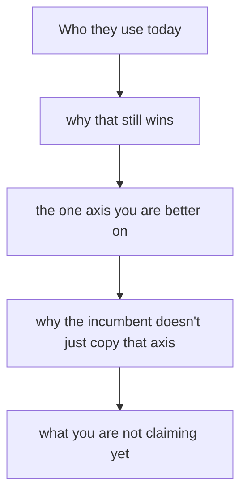

# Competition & differentiation
{: .no_toc }

*~8 min read*

**🎯 Interview frequent**

## Why it matters

"Who do you compete with?" is a truth test. Founders either say nobody, or they produce a matrix of checkmarks where their column is the only one fully checked. Both answers tell a partner you have not used the alternatives. The real set is the incumbent, the spreadsheet or intern, the other startups in the category, and doing nothing. Differentiation is the reason a specific user switches this quarter, on one axis.

## Core concepts

- **Name the set out loud.** Incumbent product (and the one they already pay for). Workaround. Other startups, including the obvious "AI for X" neighbor. Status quo. If you can't name two companies and one non-company, you are not ready for this question.
- **The status quo usually wins.** Switching has a cost: time, risk, a broken habit, a contract. Your answer should include why someone moves now, not why your feature list is longer. A trigger (a renewal, a new regulation, a broken quarter) is stronger than "we're better."
- **One axis, user-visible.** Faster on the job they timed. Cheaper in a way that shows up in their budget. Possible, when it wasn't last year, for a step they already do. "Our AI" and "better UX" are not axes until you say what the user stops doing.
- **A moat is a later claim.** Early on you have a head start, a distribution edge, or a product that is clearly better at one job. Network effects, data moats, and brand are things you might earn. Claiming them before you have them is a frequent tell. Thiel's lecture is about escaping competition by owning a small market — that is a wedge, not a moat you can assert in year one. See [Market size & wedge](../05-market-size-wedge/).
- **Use the competitor.** Partners love "we used them for a week and the break is here." They distrust a matrix built from the competitor's marketing site.
- **Room difference.** YC wants the set and the reason you'll win, in a few sentences, plus whatever you learned by touching the alternative. Seed diligence will push on "what stops the incumbent from shipping this in a year?" Have an answer that isn't "we're more passionate." A structural reason (they can't serve this segment without breaking their core pricing, the workflow is beneath their ACV, you own a channel they don't) is the one that survives.

## Mental model

Run it in that order. The matrix is optional and usually worse.

## Interview questions

1. **Who are your competitors?**
   Answer: Three layers. "Today they use [incumbent] plus a spreadsheet. [Startup] sells a broader suite to a larger buyer. Doing nothing is still the most common choice, because the pain is monthly, not daily." Then the axis. Do not open with "we don't really have competitors."

2. **Why won't [big company] just build this?**
   Answer: A structural reason tied to their business, not an insult. "Their ACV is enterprise annual contracts. This buyer is a $6k credit-card purchase, and serving them means a self-serve motion that conflicts with how their sales team gets paid." If you don't have that reason, say what your real head start is (speed with this user, a workflow they have ignored) and don't dress it up as a permanent moat.

3. **Your slide says you are the only one with all six features. What's wrong with that answer?**
   Answer: The user doesn't buy a column of checkmarks. They buy relief on one job. Pick the job, say how you know the alternatives fail it, and drop the grid. A full column of checks usually means the features were chosen to win the slide.

4. **A partner says the space is crowded and you are late.**
   Answer: Don't argue "crowded" in the abstract. Say who the user compares you to, why those options leave a specific gap, and what you have already won (a design partner, a repeated workflow, a channel). Late to a press cycle can still be early to a buyer. Late with no wedge is just late. See [Why this / why now / why you](../02-why-this-why-now-why-you/).

## Watch

- [Competition is for Losers with Peter Thiel (How to Start a Startup 2014: 5)](https://www.youtube.com/watch?v=3Fx5Q8xGU8k) — Y Combinator. Why "we'll compete in a huge market" is a weak plan, and what owning a small market is for. Pair it with [Market size & wedge](../05-market-size-wedge/).
- [Michael Seibel on how to create a great startup pitch](https://www.youtube.com/watch?v=UrdqXffoOUo) — Startup Archive. The unique-insight and "how you make money" standard: say the sharp version in a sentence or two, and don't list every possible angle.

## Further reading

- [How to Get Startup Ideas](https://paulgraham.com/startupideas.html) — Paul Graham. On noticing the idea other people are missing because it looks like a schlep or a small start.
- [Why Founders Shouldn't Think Like Investors](https://www.ycombinator.com/library/Kk-why-founders-shouldn-t-think-like-investors) — Dalton Caldwell and Michael Seibel, YC Startup Library. Includes the failure mode of picking an idea because a market map said the space was open.
