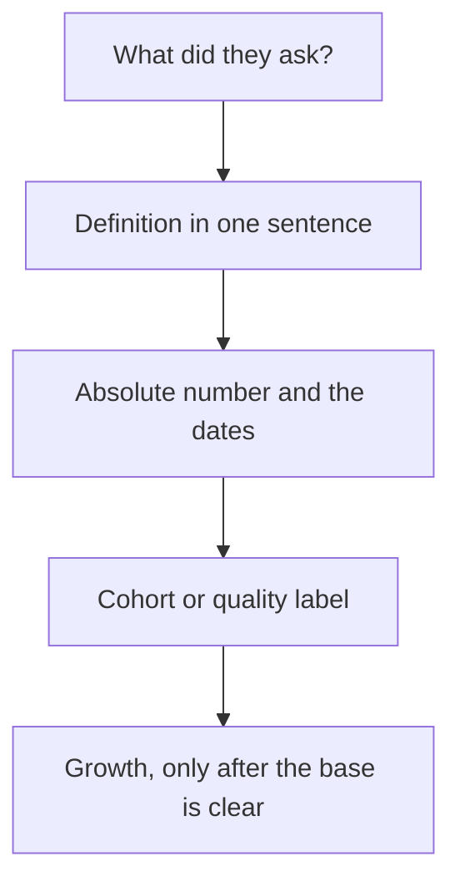

# Traction & metrics under fire
{: .no_toc }

*~9 min read*

**🎯 Interview frequent**

## Why it matters

Traction questions are arithmetic. Partners recompute your growth rate from the two numbers you just said, and they ask what a "user" is. Founders lose this section by mixing pilots with revenue, quoting a percentage with no base, or reading a blended chart that hides churn. You do not need a perfect company. You need definitions you can say without flinching, and the honesty to label what is not real yet.

## Core concepts

- **One primary metric that matches how you get paid.** SaaS: revenue that is actually recurring (MRR), plus retention of that revenue. Marketplace: GMV is not revenue; say net revenue and the take rate. Transactional: revenue, and whether last month's buyers came back. Consumer with no charge yet: the repeated action that would later be the reason to pay, and the retention of that action. Pick one. Know the absolute number.
- **Growth rate, with the window and the base.** Month-over-month is (this period / last period) − 1. A longer window is a compounded rate, so a spike in a tiny first month doesn't become "the" rate. YC's public guidance (Tim Brady's Startup School piece) is to know this offhand, and to say if the business is too seasonal for a monthly rate. "We 10x'd" from 1 to 10 users is a count. Say both the rate and the absolutes: "from $4k to $9k MRR over four months."
- **Retention is a cohort, not a blend.** Take the users or dollars you started with in a period and see what's left later. New sales on top will make a blended number look fine while the bucket leaks. Net dollar retention above 100% means that cohort's revenue grew (expansion beat churn). Below 100%, it shrank. The B2B Startup School lecture walks this with a simple cohort; you should be able to do the same with yours, even if the cohort is three customers.
- **Label the quality of the evidence.** Paid invoice. Signed pilot that is not recurring. LOI. Waitlist. "Interested." Verbal yes from a friend. These are different sentences. LOIs are not MRR. A design partner who hasn't paid is a learning, and a good one, if you call it that.
- **Vanity is whatever doesn't change the decision.** Raw signups, press, Twitter followers, app downloads with no return visit. You can mention them after the primary metric if they explain a channel. Don't lead with them.
- **If you are raising, know burn and runway.** Burn is cash out the door net of revenue, in the simple early version. Runway is cash divided by monthly burn. Brady's lecture is the right level. If you are pre-revenue and the founders are unpaid, say so; a made-up runway is worse.
- **Room difference.** YC will do the math in the minutes they have. Hesitation reads as not knowing your own company. Seed diligence will ask for the chart and the definition in a follow-up. Same numbers. Less patience for a slippery word like "user" or "revenue." See [Business model](../09-business-model-pricing/) for what counts as revenue, and [Mock Q packs](../13-mock-q-packs/) for the drill.

## Mental model

Definition, level, quality, then the rate. Reversing that order is how a true-ish percentage becomes a misleading one.

## Interview questions

1. **What's your growth rate?**
   Answer: Period, formula in plain language, rate, and absolutes. "MRR grew from $4k in May to $9k in August. That's a bit under 4x in three months, not a weekly rate, and two of the August dollars are a one-time setup fee I should pull out. Recurring is $7.5k." Offer the correction before they find it.

2. **What's your retention?**
   Answer: A cohort. "Of the 11 teams that did the core action in March, 6 did it again in April, 5 in May. April logo churn was the two pilots that never converted to paid. I don't have a clean net dollar number yet because three of the eleven aren't paying." A single "retention is 80%" with no cohort is not an answer.

3. **You have a waitlist of 2,000 and no revenue. What do you say when they ask for traction?**
   Answer: Don't call the waitlist traction. Say what it is (a channel test), what the real usage is (even if small), and what you are trying to learn next. "2,000 emails from a launch post. 40 started the workflow, 9 finished it, 0 have paid. The question we're running is whether those 9 will do it a second week." Then stop. See [The Real Product Market Fit](https://www.youtube.com/watch?v=FBOLk9s9Ci4) for why usage spikes without retention are not fit.

4. **How is a pilot different from revenue, and why do partners care?**
   Answer: Revenue is money you have earned under terms you can repeat. A pilot is a learning contract, often discounted, often not renewed yet. Partners care because the round's story changes if the chart is one and not the other. Say "one $2k pilot, two months left, not in MRR." You can still be proud of the pilot.

5. **They divide two numbers you gave and get a different growth rate. What happened?**
   Answer: You mixed windows, included a one-time, or used a blended base. Recompute with them. "You're right — I used the cumulative signups, not the monthly revenue. Monthly revenue was flat. Cumulative users are up because we haven't churned them off the list." Agree fast. Defending the prettier number is the failure.

## Watch

- [B2B Startup Metrics \| Startup School](https://www.youtube.com/watch?v=_mKeVGSqQac) — Y Combinator. Retention, net dollar retention, and why a leaky cohort does not get saved by new sales. The worked example is the one to be able to redo with your own numbers.
- [The Real Product Market Fit by Michael Seibel](https://www.youtube.com/watch?v=FBOLk9s9Ci4) — Y Combinator. Why growth that doesn't stay, and company-building theater, are not fit. Useful when your chart is a spike.

## Further reading

- [How to calculate burn rate, runway, and growth rate](https://www.ycombinator.com/library/9k-how-to-calculate-burn-rate-runway-and-growth-rate) — Tim Brady, YC Startup Library. The three numbers to know without a spreadsheet.
- [Key Startup Metrics](https://www.ycombinator.com/library/KR-key-startup-metrics) — YC Startup Library.
- [16 Startup Metrics](https://a16z.com/16-startup-metrics/) — Andreessen Horowitz. A broader catalog. Use it to pick the metric that matches the model, not to recite all sixteen.
- [Startup = Growth](https://paulgraham.com/growth.html) — Paul Graham. Why the rate, not the story, is the measure partners are reaching for.
- [How Superhuman Built an Engine to Find Product Market Fit](https://review.firstround.com/how-superhuman-built-an-engine-to-find-product-market-fit/) — First Round Review. A concrete survey method ("very disappointed" if the product went away). It is a tool for a product that already has users, not a number to claim you have hit.
