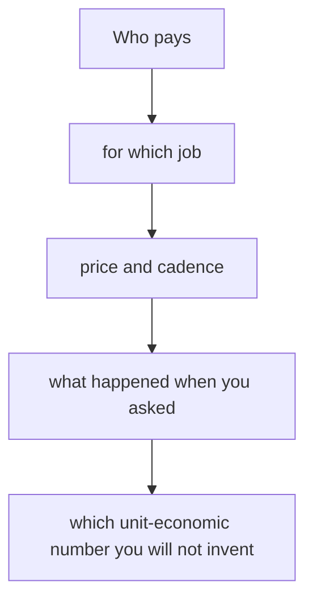

# Business model & pricing defense
{: .no_toc }

*~8 min read*

**Interview occasional**

## Why it matters

"How do you make money?" should be one sentence. Founders dodge it ("we'll figure out monetization") or stack five models ("ads, and a subscription, and maybe a marketplace"). Both read as not having decided. The occasional deeper pass is pricing: why that price, what happened when you said it out loud, and whether the number can support the company you just described. This page is that defense. It is not a finance model.

## Core concepts

- **One sentence: who pays, for what, how often, how much.** "Clinic managers pay $200 per month for the prior-auth workflow." If you don't charge yet, say what you will charge, who you asked, and what they said. "Free to grow" with no payer in mind is a consumer bet; say that explicitly.
- **Use a model that already produces large companies, unless you have a reason not to.** Aaron Epstein's Startup School lecture groups the usual ones: SaaS (recurring), transactional, marketplace (take rate on GMV), and a few others. Copy the shape that matches the buyer's habit. A novel model is a second startup hiding inside the first.
- **GMV is not revenue.** On a marketplace, say the take rate and the net. On SaaS, don't fold one-time setup into MRR. See [Traction](../07-traction-metrics-under-fire/).
- **Price on value to the buyer, not on your costs.** If the workaround costs them a part-time hire, your price is anchored there, not on your server bill. Most early teams undercharge because a low price feels easier to say. Epstein's lecture is blunt about this: charging is how you learn, and a price that is too low is not a strategy.
- **Say what you know about the price test.** You quoted it and they paid. You quoted it and they flinched, and you learned the buyer was the director, not the user. You haven't tested it. The third is acceptable. A fake "willingness to pay study" is not.
- **Unit economics at this stage are mostly unknowns with one known.** Known: price, and a rough gross margin if delivery has real cost (human services, hardware, payouts). Unknown: CAC, lifetime, payback — unless you have actually paid to acquire someone and seen them stay. "LTV/CAC is 5" with founder-sold customers is fiction. "CAC is founder time, gross margin is software-like, lifetime is unproven because our oldest paid user is three months" is an answer.
- **Room difference.** YC wants the sentence and will move on if it's crisp. They will stay if you dodge. A seed investor will push on whether price can rise and whether payback could work once a hire is selling. Have the sentence, the evidence, and the unknown in that order.

## Mental model

If the first three are fuzzy, do not talk about LTV.

## Interview questions

1. **How do you make money?**
   Answer: The one sentence. If it's the industry's normal model, say that and move on. Seibel's public advice is to not run away from advertising, usage fees, or whatever it actually is. Stacking maybes ("ads, plus pro, plus a take rate") tells them you haven't picked.

2. **Why that price?**
   Answer: The anchor and the test. "Their current tool is $150 a month and doesn't do prior auth. We asked for $200. Two of three paid it. The third said the director has to approve anything over $100, which is a buyer problem, not a price problem." If you haven't tested, say the anchor you intend to test and when.

3. **Your take rate is 3% and you called GMV revenue. Fix the sentence.**
   Answer: "GMV last month was $80k. We keep 3%, so net revenue was $2.4k. I'm not counting the $80k as revenue." Then retention of the side that pays you, if you have it. See [Traction](../07-traction-metrics-under-fire/).

4. **Isn't a low price how you win?**
   Answer: A lower price is a reason to switch only if the buyer is choosing on price and you can still have a business. Often they are choosing on the job being done. Underpricing hides the value test and starves the company. If you are temporarily cheap to remove friction for the first ten, say it's temporary and what you'll ask next.

## Watch

- [Startup Business Models and Pricing \| Startup School](https://www.youtube.com/watch?v=oWZbWzAyHAE) — Y Combinator, Aaron Epstein. Which models show up in real outcomes, and the pricing rules: charge, price on value, don't hide behind a low number.
- [Michael Seibel on how to create a great startup pitch](https://www.youtube.com/watch?v=UrdqXffoOUo) — Startup Archive. The "how you make money" minute: one sentence, the normal model for your industry, no menu of maybes.

## Further reading

- [16 Startup Metrics](https://a16z.com/16-startup-metrics/) — Andreessen Horowitz. Definitions that keep GMV, revenue, and margin from collapsing into one word.
- [B2B Startup Metrics \| Startup School](https://www.youtube.com/watch?v=_mKeVGSqQac) — Y Combinator. What retention means once someone is paying. Also on [Traction](../07-traction-metrics-under-fire/).
