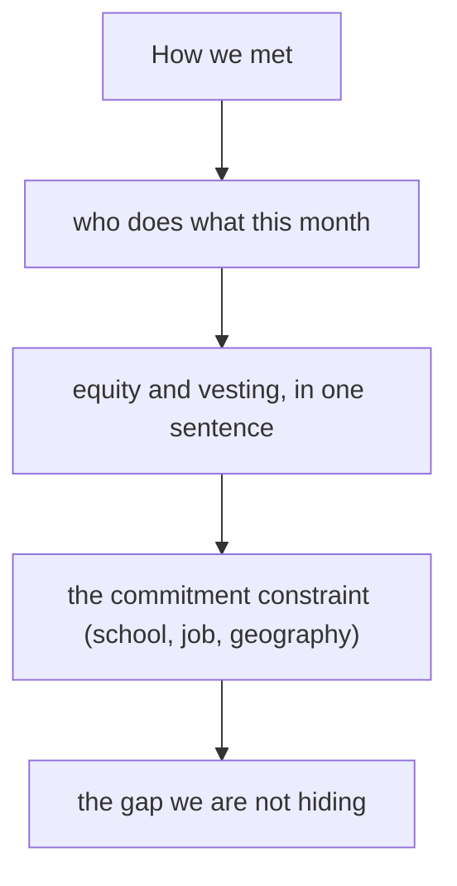

# Team, equity, roles
{: .no_toc }

*~8 min read*

**Interview occasional**

## Why it matters

Team questions get sharp when something looks off: a solo founder, a 90/10 split, a cofounder who isn't in the room, a student team that can't say what happens in May. When the team looks normal, this is a few questions and they move on to the user. This page is those questions. It is not a legal guide to stock, SAFEs, or founder agreements. Get a lawyer for the documents.

## Core concepts

- **How you met and how long you've actually worked together.** Classmates who started last month, and former coworkers who have shipped together for two years, are different risks. Say the true version. YC's public application advice treats a cofounder who isn't in the founder video as a signal. If someone is missing, explain it before they ask.
- **Roles are this month's work, not titles.** Who talks to users, who ships, who owns the number you will be asked about. "We both do everything" with no owner means nobody owns the uncomfortable task. Overlap is normal on a team of two. A missing function (nobody can build, nobody will sell) is the thing to name and address.
- **Equity: generous, vested, and not a prize for the idea.** Michael Seibel's Startup School lecture is the standard early-stage advice for VC-shaped startups: be generous with cofounder equity, prefer something close to equal when everyone is essential and full-time, and put founders on a four-year vest with a one-year cliff. A 90/10 split because "it was my idea" is a common breakup recipe. Very unequal can be fine when the contribution is actually unequal. Be ready to explain it without flinching.
- **Solo founders.** Say so. Then say how the product gets built and how users get talked to. An advisor with 0.25% is not a cofounder. A friend who "might join after they see traction" is a hope. Some companies are correctly solo. Pretending otherwise is the mistake.
- **Students and part-time, including Penn.** Commitment is the question. Hours per week now. What changes at graduation or at the end of the semester. Whether both founders are in. A team that is full-time this summer and back to class in August should say that, and say what "in" means if they get into a batch. Partners have funded students. They have also passed on teams that couldn't look up from a problem set. Don't perform full-time if you aren't.
- **Room difference.** YC will poke the split, the missing person, and the commitment because they are betting on the founders at an early stage. A seed fund that arrives later still cares, and will care more about whether the CEO can recruit the next two people. Neither room is the place to negotiate your cap table. If the split is wrong, fix the conversation with your cofounder before the interview, not during it.

## Mental model

Short, specific, and slightly uncomfortable is the right tone. A culture speech is not.

## Interview questions

1. **How did you meet your cofounder, and who does what?**
   Answer: The real origin and the current split of work. "We were on the same research project for a year. She runs the user conversations and the clinic relationships. I build. We both sit in on the weekly call with the first clinic." Titles can follow if asked. The work comes first.

2. **Why is the equity split 80/20?**
   Answer: A real reason, or fix it. A real reason sounds like "she joined six months in, is part-time through May, and we agreed 70/30 vesting over four years with a one-year cliff once she's full-time — 80/20 was the old number and it's stale." "It was my idea" is not a real reason. Seibel's lecture is the argument for generosity while the outcome is still unknown.

3. **You're a solo founder. Why should we believe the company gets built?**
   Answer: What you can do yourself, and the specific gap. "I can ship and I've done the first 20 user calls. I can't be in clinics three days a week and build. I'm hiring a founding generalist after this round, and until then the clinic visits are me on Thursdays." Don't invent a cofounder.

4. **You're both juniors. What happens if this works and you still have a year of school?**
   Answer: The actual plan. "We'd take the year off if we got in and the users were real. We've talked to our parents and we've looked at leave. If we don't, we keep it to nights and it stays small on purpose." An unexamined "we'll do both" is the weak version. A thought-through constraint is fine.

## Watch

- [Co-Founder Equity Mistakes to Avoid \| Startup School](https://www.youtube.com/watch?v=DISocTmEwiI) — Y Combinator, Michael Seibel. Generosity, vesting, cliffs, and the bad reasons for a lopsided split. This is advice for early tech startups, not a substitute for counsel.

## Further reading

- [Co-Founder Equity Mistakes to Avoid](https://www.ycombinator.com/library/LP-co-founder-equity-mistakes-to-avoid) — the same Seibel lecture in the YC library.
- [How to find the right co-founder](https://www.ycombinator.com/library/8h-how-to-find-the-right-co-founder) — YC Startup Library.
- [The Equity Equation](https://paulgraham.com/equity.html) — Paul Graham. A way to think about giving equity for what someone will actually contribute.
- [Founder Mode](https://paulgraham.com/foundermode.html) — Paul Graham. Later than this interview, and useful when a partner asks whether the founders will stay close to the work.
