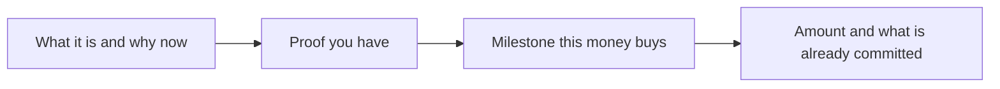

# Fundraising narrative & ask
{: .no_toc }

*~9 min read*

**🎯 Interview frequent**

## Why it matters

The story of the company and the ask are different skills, and founders blend them into a valuation speech. The narrative is why this company should exist and what evidence you have. The ask is how much you are raising, what has to be true when the money is gone, and what is already committed. YC will ask the short version if you are raising. A seed meeting is often decided on it. This page stays at interview altitude. Term sheets, SAFE clauses, and "which document" are lawyer work, and they are out of scope here.

## Core concepts

- **Narrative order.** What you do (two sentences and an example). Who it's for and why now. The proof you actually have (one customer story, one metric with a definition). Why this team. Then the ask. Biography, a tour of the technology, and a market slide before they know what you do are how good companies sound confusing. Seibel's seed-pitch talk is the checklist: what you do, team, traction, insight, market, ask.
- **The ask is an amount, a use, and a milestone.** "We're raising $1.5M. It pays the two of us and one hire for about 18 months, and the milestone is $25k MRR from clinics on the motion we already ran, not a new market." Runway is the constraint. The milestone is the point. "18 months of runway" alone is a burn description.
- **Use of funds is two or three outcomes.** Ship the thing that unblocks the next buyers. Get the metric to a level you name. Make one hire whose job you can describe. A pie chart of rent and "buffer" is not a use of funds.
- **Round status, without theater.** Who has committed, whether you have a lead, whether you have just started. "We don't have a lead; we're in first meetings" is a fine sentence. "We're closing Friday" when you are not is a trap. See [Common traps](../12-common-traps-weak-answers/).
- **Valuation is not a milestone.** YC's own essential-advice note says valuation is not success, and that some of their best-known companies raised early at modest prices. If you don't know the instrument, don't invent a cap in the room. "We're raising on a SAFE and we haven't set a cap; we'd rather talk after you want to invest" is more credible than a number you made up an hour ago. Know which process you are actually in. The documents themselves are out of scope for this guide.
- **Room difference.** In a YC interview the ask is often three questions: are you raising, how much, what will you do with it. They are not negotiating your cap there. In a seed partnership meeting the ask is the decision. Bring the milestone that would make the next round (or profitability) a different conversation, and don't spend the meeting on comps.

## Mental model

If you can't point at the milestone, the amount is a guess.

## Interview questions

1. **How much are you raising, and what will you do with it?**
   Answer: Amount, time, and the outcome. "$1.5 million, about 18 months, two founders plus one generalist. The outcome is ten paying clinics and the prior-auth workflow used every week, which is the motion we have done once by hand." If you are not raising, say so and say what would make you raise.

2. **What's your valuation?**
   Answer: Don't invent one. If you have a process, describe it plainly. "We haven't set a cap. If we do a SAFE, we'll set it when a lead is serious." If you already signed a term, you can say the shape. A monologue about comps is not a valuation defense at this stage. The price is not the achievement. YC's essential startup advice says this directly, and points at Seibel on fundraising rounds not being milestones.

3. **Who else is in the round?**
   Answer: The truth, including names you are allowed to say and amounts that are actually committed. "Two angels, $150k signed, no fund lead yet. I'm talking to you and two other funds." Soft circles and "they're very excited" don't count as in. Overstating a commit gets found in diligence and ends the process.

4. **Why raise at all? You have revenue.**
   Answer: The milestone you cannot reach on the current burn, and why that milestone matters. "We're at $7k MRR, founder-sold. The raise is so I stop being the only person on clinic calls, and we see if the email works without me. If it doesn't, we shouldn't hire past that." Raising because fundraising feels like progress is the failure mode in YC's own "fundraising is not the work" advice.

5. **Walk me through the story in two minutes.**
   Answer: Do the order above and land on the ask. Practice it out loud with a timer. If you are over two minutes, you included the architecture or your childhood. Cut those first.

## Watch

- [How To Perfectly Pitch Your Seed Stage Startup With Y Combinator's Michael Seibel](https://www.youtube.com/watch?v=lw2X3PxKlAY) — SaaStr. The seed-pitch elements: what you do, team, traction, insight, market, ask. Aimed at pre-product-market-fit companies, which is the right altitude.
- [How Pitching Investors is Different Than Pitching Customers - Michael Seibel](https://www.youtube.com/watch?v=pQnOBHNKlgs) — Y Combinator. Why investor language has to be concrete and jargon-free, which is the narrative half of the raise.

## Further reading

- [A guide to seed fundraising](https://www.ycombinator.com/library/4A-a-guide-to-seed-fundraising) — Geoff Ralston, YC Startup Library. The practical seed guide: why, when, and how, without turning it into a legal manual.
- [How startup fundraising works](https://www.ycombinator.com/library/Il-how-startup-fundraising-works) — Brad Flora, YC Startup Library. The demystified version: meetings, not mythology.
- [How to Raise Money](https://paulgraham.com/fr.html) — Paul Graham.
- [A Fundraising Survival Guide](https://paulgraham.com/fundraising.html) — Paul Graham. The emotional shape of a raise, which is useful before you walk in defensive.
- [Writing a Business Plan](https://www.sequoiacap.com/article/writing-a-business-plan/) — Sequoia Capital. A checklist for the narrative. The ask still has to be yours.
