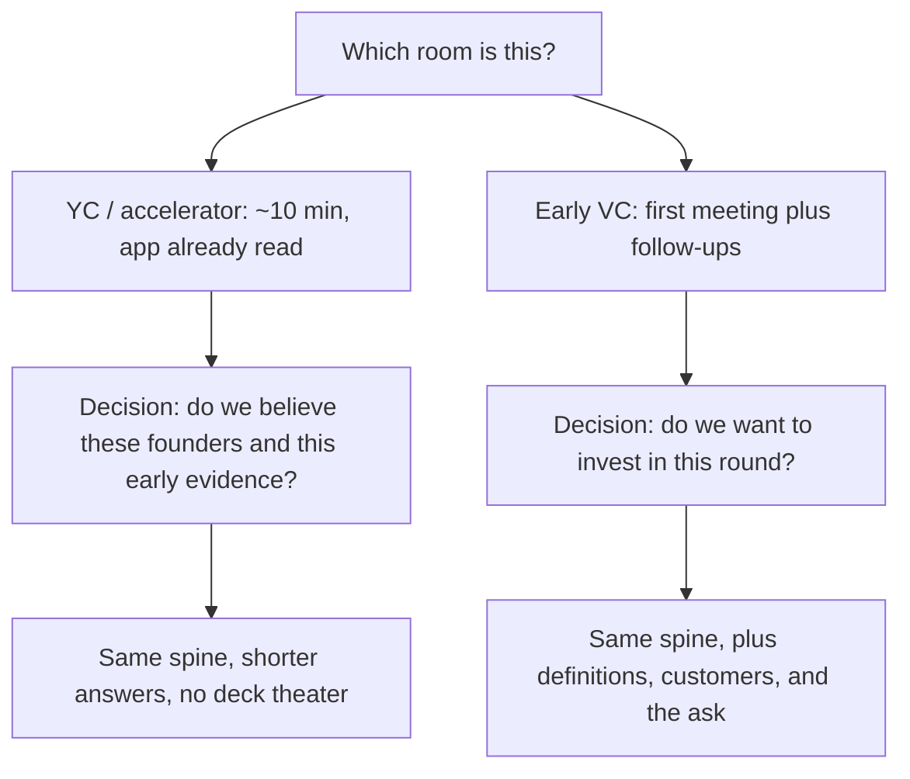

# 面試形式（YC vs VC diligence）
{: .no_toc }

*約 8 分鐘*

**面試偶爾會問**

## 為什麼重要

同一家公司的故事，在不同房間會以不同方式失敗。拿一份 12 頁的 seed deck 去打 YC 面試，是浪費。用一句加速器式的回答，去應付一場本來要評估要不要投這一輪的 seed partner meeting，也是浪費。準備你真正要走進的那個房間。問題重疊。時間、手上的材料、以及對方要做的決定，並不重疊。

## 核心概念

- **YC（以及多數加速器面試）很短，而且對方已經讀過資料。** 大約 10 分鐘，兩到三位 partner 讀過申請。他們會打斷你。他們在決定的是：這組創辦人懂不懂自己的公司、能不能被信任進一個 batch，不是 deck 好不好看。YC 公開的談話（Dalton Caldwell 談申請、Michael Seibel 談 pitch）把這描述成一場會懲罰空話開場的對話。
- **他們會抓什麼。** 公司具體在做什麼。用戶是誰。一個真實用戶做了什麼。你怎麼賺錢。你寫進申請裡的任何一個數字。為什麼是這個團隊。他們會挑最弱的那一句，然後停在那裡。一段從頭到尾沒被打斷的精緻概覽，通常代表你講太久，沒被測試到。
- **早期 VC 盡職調查是一個流程，不是一個時段。** 第一次會議（常常半小時到一小時）加上後續：指標定義、一兩個客戶、這一輪怎麼在組。決定的是要不要投這一輪。他們要的還是同一條主軸：why this、why now、why you、產品、市場、traction、競爭、go-to-market、團隊、ask。而且他們有時間去核對定義。
- **手上的材料。** YC：申請表，和你的嘴。在那個房間把 deck 投到螢幕上，通常是錯的。Seed：一份短 deck 很正常，真正有用的附錄是指標定義，加上一個客戶故事。帶著 deck。如果他們一開始就丟問題，要準備在第一分鐘就放下它。
- **節奏。** 在短的房間裡，回答被問到的那個問題，然後停。讓他們拉下一條線。在長的房間裡，先講兩分鐘的敘事（這是什麼、給誰、證據、ask），然後進問答。把時間講完，兩種房間都會失敗。
- **誠實在兩邊都成立。** 如果一個數字是 pilot、LOI，或「founder-sold」，在他們問之前就說。短的房間會用算術抓到。長的房間會在盡職調查裡抓到。見[常見陷阱](../12-common-traps-weak-answers/)。

## 心智模型

先說出這是哪一種房間，再練那個房間裝得下的答案長度。

## 面試問題

1. **Partner 在你第二句就打斷，問「who is the user?」你怎麼做？**
   答：回答那個問題。一個具體的用戶、他做什麼、問題上次出現是什麼時候。然後停。回去把概覽講完，等於告訴他們你不能被重新導向。概覽可以等。用戶不能等。見[問題清晰度](../03-problem-clarity-customer-stories/)。

2. **YC 面試和 seed partner meeting，準備應該差在哪？**
   答：同一組事實，不同的包裝。YC：練 10 分鐘、會被打斷、沒有投影片。一句話的產品、一個客戶、申請裡的數字、你怎麼賺錢、共同創辦人的故事。Seed meeting：加上一段短敘事、一份你可以跳過的 deck、指標定義，以及一個清楚的 ask。Seed 的後續會要你證明，YC 當時只來得及戳一下的那些東西。

3. **你有一份 12 頁的 deck。YC 面試要不要共享螢幕？**
   答：不要。他們有申請表。共享螢幕是把你僅有的那幾分鐘，花在他們之後可以自己讀的投影片上。如果一個數字講出來比秀出來更容易，就講。如果他們要求看某個東西，再秀那個東西。

4. **一位 associate 說「walk me through the deck」，partner meeting 在下週。那場會議是幹嘛的？**
   答：它是 partner meeting 的過濾，也是準備。先給兩分鐘版本，然後讓他們拉。主動給出主要指標的定義，以及一個他們可以打給的客戶。不要把 associate 當成一場可以燒掉的練習 pitch。他們的筆記，就是 partner 會讀的摘要。

## 觀看

- [How to Apply and Succeed at Y Combinator by Dalton Caldwell](https://www.youtube.com/watch?v=8yiOcCPvyNE) — Y Combinator。申請和面試實際在做什麼，包括創辦人影片，以及不照指示做的代價。
- [Tips on How to Get into the BEST Startup Accelerator in the World - Y Combinator](https://www.youtube.com/watch?v=-4Jyiz58sp4) — Justin Kan。一位前 YC partner 從創辦人這邊談，batch 是給誰的，以及怎麼想申請這件事。

## 延伸閱讀

- [How to Pitch Your Company](https://www.ycombinator.com/library/4b-how-to-pitch-your-company) — YC Startup Library。短的口頭 pitch，也就是加速器那個房間要的材料。
- [How to Raise Money](https://paulgraham.com/fr.html) — Paul Graham。一輪募資實際的感覺。那是 10 分鐘面試所不是的 seed meeting 脈絡。
- [Writing a Business Plan](https://www.sequoiacap.com/article/writing-a-business-plan/) — Sequoia Capital。較長的盡職調查流程會期待的故事大綱。把它當主題清單，不要把它做成 40 頁文件。
