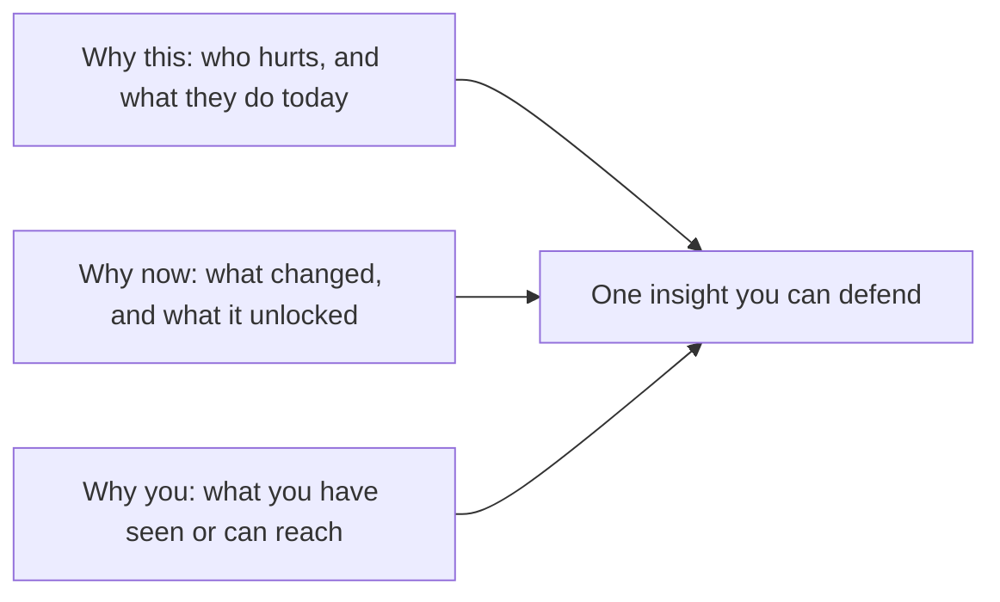

# Why this / why now / why you
{: .no_toc }

*約 9 分鐘*

**🎯 面試高頻**

## 為什麼重要

這是三個問題。創辦人用一個詞回答：熱情。Partner 聽到的是「我們沒有機制」。Why this 是痛。Why now 是讓這家公司在今年成為可能的那個變化。Why you 是為什麼這個團隊看得到、而且夠得著。強的回答，三個下面各有一個事實。弱的回答，三個下面都是形容詞。

## 核心概念

- **Why this。** 已經有人在付錢讓這個問題消失，用的是錢、時間，或一個很爛的替代做法（試算表、群組、實習生、一個他們討厭的工具）。Kevin Hale 公開的測試在這裡很好用：問題如果頻繁、急、貴，或剛變成必須做的，就比較容易被相信。「大家會喜歡這個」不是 why this。
- **Why now。** 講出一個變化，以及它解鎖了什麼。某個技術原料的成本崩了。一條法規創造了買家。一個行為移走了（團隊已經住在你要接進去的那個工具裡）。「AI 很熱」是一波浪潮，不是 why now，除非你能說出哪一個工作流程剛剛變得夠便宜、或夠好，可以取代那個替代做法。如果這個點子五年前同樣做得到，就說你現在知道、當時的創辦人不知道的是什麼。
- **Why you。** Founder-market fit：你活過這個問題，你做得出這個東西，或者你比一個聰明的外人更快接觸到用戶。「我們是 Penn 學生，我們很努力」是工作倫理。它要變成優勢，只有在用戶是你真的接觸得到的人（校園裡的買家、一個實驗室、你所在的社群），或你有產品需要的那項技能。一個 insight 是聰明人也會反駁的信念，而且綁在你親眼看過的事情上。
- **你需要一個真的優勢，不是五句口號。** Hale 的課把不公平優勢框成：創辦人的 insight、一個在長大的市場、產品在某一個軸上明顯好很多、接觸用戶的便宜方法，或一條走向壟斷的路。一個是真的，勝過一張五個都宣稱自己有的投影片。
- **兩個房間怎麼加重。** YC 面試會把稀少的分鐘花在 why you，以及你有沒有見過用戶。早期 VC 有更多時間去評估 why now，因為這一輪要成立，那個窗口必須是真的。三個都準備。見[市場規模與 wedge](../05-market-size-wedge/)：那個只是「市場很大」的 now。見[團隊](../10-team-equity-roles/)：那個其實是共同創辦人問題的 you。

## 心智模型

拿掉任何一格，公司故事聽起來還是一樣，那一格就是空的。

## 面試問題

1. **為什麼是你們這個團隊來做？**
   答：一個具體的優勢，不是履歷導覽。「這個工作流程我跑了兩年，我們用的工具把 X 和 Y 之間的交接弄掉了」，或「我們做得出模型，前十個用戶是已經會回我們訊息的人」。再用一句話講共同創辦人補上你不會的那一塊。努力，和一個相關的主修，是背景。它們不是那個優勢。

2. **Why now？為什麼不是五年前，為什麼不是五年後？**
   答：講出變化和後果。形狀像這樣：「這個客群的發票量在過去兩年進到一個有 API 的系統，所以以前要一個導入團隊才能做的工作流程，現在是一個產品。」如果你誠實的答案是「我們剛剛才注意到」，就說你注意到什麼，以及為什麼用戶今年準備好了。不要借一個你連不到買家行事曆的趨勢。

3. **Partner 說「這聽起來像 lifestyle business，不是 startup。」他實際在問什麼？**
   答：這個痛、而且窄的問題，有沒有一條路走向一家可以變大的公司。用 wedge 和下一個相鄰的用戶回答，不要用抱負。「第一個買家是 X，人數夠多、值得做，而且這個工作流程一旦存在，同樣的痛會出現在 Y。」見[市場規模與 wedge](../05-market-size-wedge/)。熱情回答不了這個。

4. **Why this 和你的產品描述差在哪？**
   答：Why this 是你還不存在時，用戶的處境。產品是你選擇做出來回應的東西。從處境開始：誰、多常、代價是什麼、他們今天怎麼做。然後用一句話講產品。從產品開始的創辦人，通常說不出為什麼有人要換。

## 觀看

- [Kevin Hale - How to Evaluate Startup Ideas](https://www.youtube.com/watch?v=DOtCl5PU8F0) — Y Combinator。把新創點子當成一個假設：問題、解法，以及可能讓它長大的 insight。這是 why this 和 why you 最乾淨的公開版本。
- [How To Change The World? Get The Small Things Right – Dalton Caldwell and Michael Seibel](https://www.youtube.com/watch?v=qnav9vgHDHs) — Y Combinator。談那些不風光、但會產生真正 why you 的研究，而不是一個表面的點子。

## 延伸閱讀

- [How to Get Startup Ideas](https://paulgraham.com/startupideas.html) — Paul Graham。從一個你知道的問題開始，並且對「以點子的形式抵達」的點子保持懷疑。
- [Organic Startup Ideas](https://paulgraham.com/organic.html) — Paul Graham。那種因為自己需要，所以出現的 why you。
- [Schlep Blindness](https://paulgraham.com/schlep.html) — Paul Graham。為什麼好點子常常看起來像別人在躲的苦工。
- [What makes great founders stand out?](https://www.ycombinator.com/library/64-what-makes-great-founders-stand-out) — Michael Seibel，YC Startup Library。執行、溝通、以及維持動力。Partner 在房間裡看得到的 why you。
