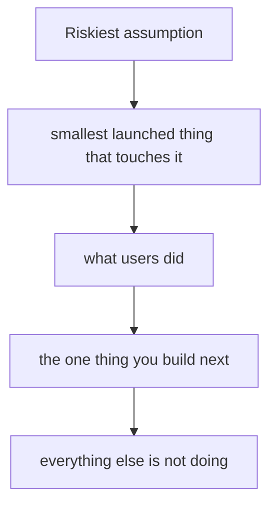

# 產品判斷與優先順序
{: .no_toc }

*約 8 分鐘*

**面試偶爾會問**

## 為什麼重要

「你們做什麼？」幾乎每一場創辦人面試都會出現，而且通常一分鐘就結束。偶爾會往下挖的是優先順序：你做了什麼、砍了什麼、為什麼是這個順序。Partner 在聽的是，這個產品是不是押在一個具體的用戶風險上，還是在導覽這家公司有一天可能變成的所有東西。

## 核心概念

- **兩句話，然後一個例子。** Michael Seibel 公開的 pitch 標準：用白話說它做什麼，然後一個具體的場景。「Airbnb 讓房東出租一個房間。訂到的時候他們抽成。一個在華盛頓特區、就職週有空房的服務生。」「一個運用 AI 來轉型工作流程的平台」過不了這個測試。見[常見陷阱](../12-common-traps-weak-answers/)。
- **MVP 是你已經推出的一個測試，不是一個縮小的願景。** Seibel 在 Startup School 的版本：限時、寫規格、砍規格，不要愛上 v1。如果它「快好了」已經一個學期，產品決定就是那個拖延。風險最高的假設，應該是 v1 碰到的東西。其他都可以手動。
- **在房間裡用三張清單排優先順序。** 現在（用戶今天做得到什麼）。下一步（證據說該做的那一件）。不做（一個你殺掉的、聽起來合理的功能，以及用戶側的理由）。一張十二項的路線圖告訴他們你還沒有選擇。
- **在用戶這週已經在乎的一個軸上更好。** 更快、更便宜，或讓他們這週在做的一件工作變成可能。功能清單不是 10 倍。如果你說不出那個軸，你是在描述活動。
- **YC 和 seed 在產品上的差別。** 加速器那個房間要的是你出貨了、也學到了。Seed meeting 還會問，這個 wedge 產品是更大產品的種子，還是一個死路 demo。你應該知道哪些功能只是為了碰到第一個用戶，哪些是更大的公司需要的。見[市場規模與 wedge](../05-market-size-wedge/)。

## 心智模型

面試的答案是這條鏈，不是功能清單。

## 面試問題

1. **產品做什麼？**
   答：外行人想得到畫面的兩句話，加上一個裡面有人的例子。然後停。如果他們要技術，他們會問。從模型、架構或願景開始，是創辦人把產品很模糊這件事藏起來的方式。

2. **你決定不做什麼，為什麼？**
   答：一個真的砍掉的東西。「我們沒做管理後台。第一批用戶就是主管本人，一個共用收件匣就夠了。等同一家公司的第二個座位變成擋下交易的東西，我們再做權限。」為什麼應該引用一個用戶或一個期限，不是品味。

3. **你做了四個月還沒上線。這件事你怎麼講？**
   答：用一句話說卡在哪，然後是你把它放到用戶面前的日期，以及你會學到什麼。「整合需要他們的測試租戶；星期二拿到；測試是他們那一週能不能完成一次真的 prior auth。」更長的品質辯護聽起來像害怕。Seibel 的標準是對的：先上一個窄的東西，再跟用戶一起改。

4. **Partner 問這怎麼變成一個大產品，而不是一個功能。**
   答：把 v1 和後面的路分開。「V1 替換這個買家工作流程裡的這一步。同一個買家還有三個相鄰的步驟，用的是同一份資料。第一步還沒有每週被用，我們不會做那些。」那是產品的順序。「我們會變成這個產業的作業系統」是願望。

## 觀看

- [Michael Seibel - How to Plan an MVP](https://www.youtube.com/watch?v=1hHMwLxN6EM) — Y Combinator。限時、寫規格、砍掉、上線，不要愛上第一個版本。
- [Secrets You Can Learn From Your Customers](https://www.youtube.com/watch?v=IdwYMfM2QMs) — Y Combinator，Michael Seibel 與 Dalton Caldwell。坐在用戶旁邊怎麼改變你做的東西，案例是 Airbnb 和 Brex。

## 延伸閱讀

- [How to plan an MVP](https://www.ycombinator.com/library/6f-how-to-plan-an-mvp) — Michael Seibel，YC Startup Library。同一堂課的文字版，如果你想要清單、不要影片。
- [Do Things that Don't Scale](https://paulgraham.com/ds.html) — Paul Graham。手動的產品工作是合法的 v1。
