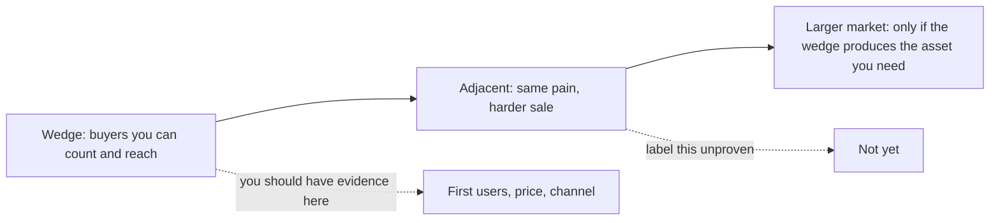

# 市場規模與 wedge
{: .no_toc }

*約 9 分鐘*

**🎯 面試高頻**

## 為什麼重要

「市場有多大？」是創辦人常常在選完點子之後，才去找一個數字來回答的問題。Partner 聽得出來。他們用得上的答案有兩部分：一個你數得出來的第一個市場，以及那個市場是進入更大市場的 wedge 的理由。YC 會用一個追問懲罰假的 TAM。Seed 投資人仍然需要更大的故事，因為一輪募資必須有辦法變得重要。兩個都給，並標出你哪一步有證據。

## 核心概念

- **先從下往上。** 數你有路徑碰到的買家，乘上他們付多少，再乘上頻率。「美國大約有 4,000 家這種公司，他們換掉的工具大約一年 $8k，我們看過兩筆那個水準的預算。」這可以被核對。「$50 billion 的產業，我們拿 1%」不能。
- **Wedge 是一個市場，不是一個人口統計。** 一個 beachhead 有買家、有預算或習慣、有他們彼此說話的方式，以及一條你接觸得到他們的路。「Gen Z」不是 wedge。「已經在用這套支付系統的學校裡，社團體育的財務」可能是。Peter Thiel 的課是經典版本：Facebook 從一個校園開始，Amazon 從書開始。小市場就是重點，因為他們贏得到。
- **把擴張說成一連串相鄰，並標出還沒被證明的那一步。** Wedge → 共用這個工作流程的下一個用戶 → 更廣的市場。「我們從獨立診所開始。醫院體系是同樣的 prior-auth 痛，但是另一種銷售。我們還沒賣進醫院。」承認缺口的那一句，partner 會信。
- **一個在長大的市場是順風，不是計畫。** 「這個類別一年成長 20%」在 Hale 的框架裡是不錯的背景。它取代不了 wedge。預算在縮、或是平的，是一個真的異議；用誰仍然有痛、仍然有預算來回答，或承認時機不好。
- **除非你定義得了，否則跳過縮寫堆疊。** TAM / SAM / SOM 可以，當每一層都是真的篩選（誰有這個問題、你接觸得到誰、你先贏得到誰）。背三個你導不出來的整數，比一個由下往上的計數更糟。
- **房間的差別。** 在短的 YC 面試，先講 wedge 的計數，再用一句話講擴張。在 seed 盡職調查，準備秀出篩選：排除了什麼、為什麼價格可信、第二個市場要成立必須什麼是真的。見[募資敘事](../11-fundraising-narrative-ask/)。

## 心智模型

贏下一個你叫得出名字的市場。下一個，當成假設來描述。

## 面試問題

1. **市場有多大？**
   答：由下往上，然後 wedge，然後一句擴張。「大約 4,000 個買家，一年約 $8k，所以 beachhead 如果全拿下來是低數千萬，而我們不會全拿。值得在乎的理由是，這份工作流程資料，跟醫院集團已經付更多錢的是同一份。我們還沒進到那個銷售。」如果你只有那個大數字，你還沒有答案。

2. **這是不是太小？**
   答：用 Thiel 的意思說，為什麼小市場是對的第一個：你可以在那裡成為預設，而且贏下它會給你下一個市場需要的資產（通路、資料、一個工作流程）。然後說「太小」實際長什麼樣子：如果 beachhead 撐不起一個真的價格，或哪裡都去不了。不要把計數灌大來逃開這個問題。

3. **那個 TAM 從哪來？**
   答：把算術大聲走一遍。來源、包含什麼、排除什麼，以及你最不確定的假設。「4,000 來自公會名錄，篩到至少有一個行政的公司。$8k 是現有廠商的定價，我們只看過兩份真正的合約。價格是弱的那一段。」捏造的精確是陷阱。一個有來源的範圍是答案。見[常見陷阱](../12-common-traps-weak-answers/)。

4. **Seed partner 說 wedge 有趣，大市場是在揮手。你讓哪一步？**
   答：把還沒被證明的那一步指名讓掉，並說什麼證據會把它從故事升成計畫。「醫院擴張是假設。我們欠你的證據是一個 design partner，和一個重複的工作流程，不是一張 TAM 投影片。這一輪的大小是為了把 wedge 做到留存的營收，不是為了進醫院。」那是可以募的誠實。假裝你已經有第二個市場，不是。

## 觀看

- [Competition is for Losers with Peter Thiel (How to Start a Startup 2014: 5)](https://www.youtube.com/watch?v=3Fx5Q8xGU8k) — Y Combinator。先支配一個極小的市場、再往外擴的論點。練「這是不是太小？」時，用 Facebook / Amazon / 「vast ocean 裡的小魚」那一段。
- [How To Perfectly Pitch Your Seed Stage Startup With Y Combinator's Michael Seibel](https://www.youtube.com/watch?v=lw2X3PxKlAY) — SaaStr。市場規模在 seed pitch 裡的位置：一句清楚的陳述，不是一個表演用的數字。演講其餘是完整的 pitch；把市場規模的標準拿走。

## 延伸閱讀

- [Kevin Hale - How to Evaluate Startup Ideas](https://www.youtube.com/watch?v=DOtCl5PU8F0) — Y Combinator。市場成長的測試，以及為什麼只有一個在長大的市場是很弱的優勢。（[Why this / why now / why you](../02-why-this-why-now-why-you/) 也連到這支。）
- [How to Get Startup Ideas](https://paulgraham.com/startupideas.html) — Paul Graham。可以擴張的窄起點，對上從第一天就瞄準一個市場的點子。
