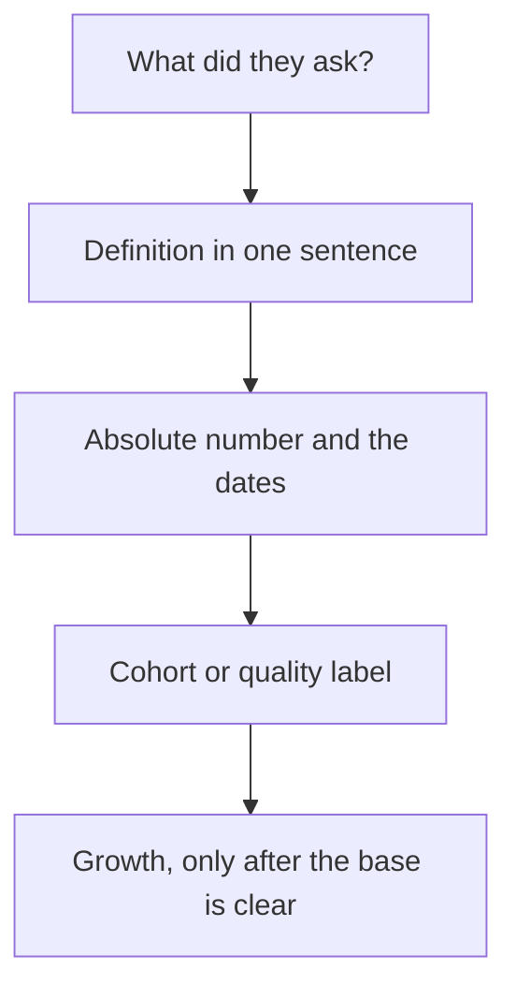

# Traction 與指標追問
{: .no_toc }

*約 9 分鐘*

**🎯 面試高頻**

## 為什麼重要

Traction 的問題是算術。Partner 會用你剛剛說的兩個數字重算成長率，也會問「user」是什麼。創辦人在這一段輸掉，是因為把 pilot 和營收混在一起、報一個沒有基數的百分比，或唸一張把 churn 藏起來的混合圖。你不需要一家完美的公司。你需要的是說出口不會退縮的定義，以及把還沒成真的東西標出來的誠實。

## 核心概念

- **一個跟你怎麼收錢對得上的主要指標。** SaaS：真正在重複的營收（MRR），加上那份營收的 retention。Marketplace：GMV 不是營收；講淨營收和 take rate。交易型：營收，以及上個月的買家有沒有回來。還沒收費的消費產品：那個之後會成為付錢理由的重複行為，以及那個行為的 retention。選一個。知道絕對數字。
- **成長率，要有窗口和基數。** 月對月是（這一期 / 上一期）− 1。更長的窗口是複合成長，所以第一個月很小的時候衝一下，不會變成「那個」成長率。YC 的公開建議（Tim Brady 的 Startup School 文章）是這個要隨口就知道，而且如果生意季節性太強、不適合月成長率，就要說。「我們 10 倍了」從 1 個用戶到 10 個，是一個計數。成長率和絕對數字一起說：「四個月裡 MRR 從 $4k 到 $9k。」
- **Retention 是 cohort，不是混合。** 拿某一期開始的用戶或金額，看後來還剩多少。上面再疊新銷售，會讓混合數字看起來沒問題，同時那個桶子在漏。Net dollar retention 超過 100%，代表那個 cohort 的營收長大了（擴張打贏 churn）。低於 100%，它縮了。B2B Startup School 的課用一個簡單的 cohort 走這個；你應該能用你自己的做一樣的事，即使那個 cohort 只有三個客戶。
- **把證據的品質標出來。** 已付的發票。簽了、但不是重複的 pilot。LOI。Waitlist。「有興趣。」朋友口頭說好。這些是不同的句子。LOI 不是 MRR。一個還沒付錢的 design partner 是學習，而且如果你好好這樣叫它，是好的學習。
- **虛榮，是任何不改變決定的東西。** 原始註冊數、媒體、Twitter 追蹤、沒有回訪的 app 下載。如果它們解釋一條通路，可以在主要指標之後提。不要用它們開頭。
- **如果要募資，知道 burn 和 runway。** 在早期的簡單版本裡，burn 是出去的現金扣掉營收。Runway 是現金除以每月 burn。Brady 的課是對的層級。如果你還沒有營收、創辦人沒領薪水，就這樣說；一個編出來的 runway 更糟。
- **房間的差別。** YC 會在他們有的那幾分鐘裡做算術。猶豫讀起來像不認識自己的公司。Seed 盡職調查會在後續要圖和定義。同一組數字。對「user」或「revenue」這種滑的詞更沒耐心。什麼算營收，見[商業模式](../09-business-model-pricing/)。練習見 [Mock Q packs](../13-mock-q-packs/)。

## 心智模型

定義、水位、品質，然後才是成長率。把順序反過來，就是一個大致為真的百分比變成誤導的方式。

## 面試問題

1. **你的成長率是多少？**
   答：期間、白話的公式、成長率，以及絕對數字。「MRR 從五月的 $4k 長到八月的 $9k。三個月不到 4 倍，不是週成長率，而且八月的金額裡有一筆是一次性設定費，我應該拿掉。重複的是 $7.5k。」在他們找到之前，先把修正交出去。

2. **你的 retention 是多少？**
   答：一個 cohort。「三月做了核心行為的 11 個團隊，6 個在四月又做了，5 個在五月。四月的 logo churn 是兩個從來沒轉成付費的 pilot。我還沒有乾淨的 net dollar 數字，因為十一個裡有三個沒在付錢。」單獨一句「retention 是 80%」、沒有 cohort，不是答案。

3. **你有 2,000 人的 waitlist，沒有營收。他們問 traction 時你說什麼？**
   答：不要把 waitlist 叫做 traction。說它是什麼（一個通路測試）、真正的使用是什麼（即使很小），以及你下一步想學什麼。「一篇上線貼文來的 2,000 封 email。40 個開始了工作流程，9 個做完，0 個付費。我們在跑的問題是，那 9 個會不會在第二週再做一次。」然後停。為什麼沒有 retention 的使用尖峰不是 fit，見 [The Real Product Market Fit](https://www.youtube.com/watch?v=FBOLk9s9Ci4)。

4. **Pilot 和營收差在哪，為什麼 partner 在乎？**
   答：營收是你在可以重複的條件下已經賺到的錢。Pilot 是一份學習合約，常常打折，常常還沒續。Partner 在乎，是因為如果圖是其中一個而不是另一個，這一輪的故事就變了。說「一個 $2k 的 pilot，還剩兩個月，不在 MRR 裡。」你仍然可以為這個 pilot 感到得意。

5. **他們把你給的兩個數字相除，得到不一樣的成長率。發生了什麼？**
   答：你混了窗口、放進了一筆一次性，或用了混合的基數。跟他們一起重算。「你說得對。我用的是累積註冊，不是每月營收。每月營收是平的。累積用戶上升，是因為我們沒有把他們從名單上 churn 掉。」快點同意。捍衛比較漂亮的數字，才是失敗。

## 觀看

- [B2B Startup Metrics | Startup School](https://www.youtube.com/watch?v=_mKeVGSqQac) — Y Combinator。Retention、net dollar retention，以及為什麼一個在漏的 cohort 不會被新銷售救回來。那個算過的例子，是你要能用自己的數字重做的。
- [The Real Product Market Fit by Michael Seibel](https://www.youtube.com/watch?v=FBOLk9s9Ci4) — Y Combinator。為什麼留不住的成長，以及把公司做出來的表演，都不是 fit。你的圖是一根尖峰時有用。

## 延伸閱讀

- [How to calculate burn rate, runway, and growth rate](https://www.ycombinator.com/library/9k-how-to-calculate-burn-rate-runway-and-growth-rate) — Tim Brady，YC Startup Library。不用試算表也要知道的三個數字。
- [Key Startup Metrics](https://www.ycombinator.com/library/KR-key-startup-metrics) — YC Startup Library。
- [16 Startup Metrics](https://a16z.com/16-startup-metrics/) — Andreessen Horowitz。更廣的目錄。用它來選跟模式對得上的指標，不是把十六個都背出來。
- [Startup = Growth](https://paulgraham.com/growth.html) — Paul Graham。為什麼 partner 伸手去抓的是成長率，不是故事。
- [How Superhuman Built an Engine to Find Product Market Fit](https://review.firstround.com/how-superhuman-built-an-engine-to-find-product-market-fit/) — First Round Review。一個具體的問卷方法（如果產品消失會「非常失望」）。它是給已經有用戶的產品的工具，不是一個你可以宣稱自己已經達到的數字。
