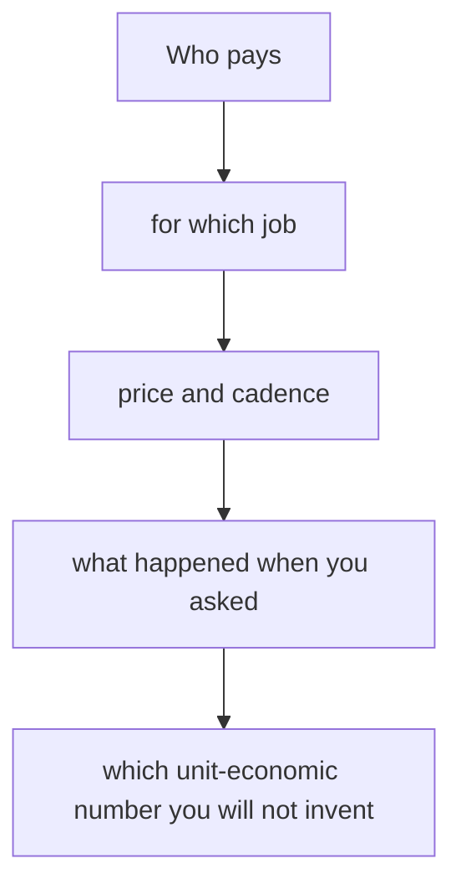

# 商業模式與定價
{: .no_toc }

*約 8 分鐘*

**面試偶爾會問**

## 為什麼重要

「你怎麼賺錢？」應該是一句話。創辦人躲避它（「變現之後再想」），或疊五個模式（「廣告，再加上訂閱，也許再加一個 marketplace」）。兩者讀起來都是還沒決定。偶爾會往下挖的是定價：為什麼是那個價格、你大聲說出來時發生了什麼、以及那個數字能不能撐起你剛剛描述的公司。這一頁是那個辯護。它不是財務模型。

## 核心概念

- **一句話：誰付、為了什麼、多久一次、多少。** 「診所行政一個月付 $200，買 prior-auth 的工作流程。」如果你還沒收費，說你會收多少、你問了誰、他們說了什麼。「先免費長大」但心裡沒有付款的人，是一個消費產品的賭注；明確這樣說。
- **用一個已經產生過大公司的模式，除非你有理由不這樣做。** Aaron Epstein 的 Startup School 課把常見的分成：SaaS（重複）、交易型、marketplace（GMV 上的 take rate），以及其他幾個。複製跟買家習慣對得上的形狀。一個新穎的模式，是藏在第一家新創裡面的第二家新創。
- **GMV 不是營收。** 在 marketplace，講 take rate 和淨額。在 SaaS，不要把一次性設定費折進 MRR。見 [Traction](../07-traction-metrics-under-fire/)。
- **價格錨在對買家的價值，不是你的成本。** 如果替代做法的代價是一個兼職，你的價格錨在那裡，不是你的伺服器帳單。多數早期團隊收太少，因為低價比較好說出口。Epstein 的課對這件事很直接：收費是你學習的方式，價格太低不是策略。
- **說你對價格測試知道什麼。** 你報了價，他們付了。你報了價，他們退縮，然後你學到買家是主任，不是用戶。你還沒測。第三種可以接受。一個假的「付費意願研究」不行。
- **這個階段的單位經濟，大多是未知，加上一個已知。** 已知：價格，以及如果交付有真的成本（人力服務、硬體、撥款），一個粗略的毛利。未知：CAC、生命週期、回本。除非你真的付過錢拿到一個人，而且看到他留下。「LTV/CAC 是 5」、客戶是創辦人自己賣的，是虛構。「CAC 是創辦人的時間，毛利像軟體，生命週期還沒被證明，因為最老的付費用戶是三個月」是答案。
- **房間的差別。** YC 要那一句話，如果乾淨就會往下走。如果你躲避，他們會留在那裡。Seed 投資人會追價格能不能上升，以及一旦有人在賣，回本有沒有可能成立。順序是：那句話、證據、未知。

## 心智模型

如果前三個是模糊的，不要談 LTV。

## 面試問題

1. **你怎麼賺錢？**
   答：那一句話。如果它是這個產業的正常模式，這樣說，然後往下。Seibel 公開的建議是不要逃離廣告、使用費，或它實際是什麼。把 maybe 疊起來（「廣告，加上 pro，再加上 take rate」）告訴他們你還沒選。

2. **為什麼是那個價格？**
   答：錨，和測試。「他們現在的工具一個月 $150，不做 prior auth。我們要 $200。三個裡兩個付了。第三個說超過 $100 要主任批，那是買家問題，不是價格問題。」如果還沒測，說你打算測的錨，以及什麼時候。

3. **你的 take rate 是 3%，你把 GMV 叫做營收。把句子改對。**
   答：「上個月 GMV 是 $80k。我們留 3%，所以淨營收是 $2.4k。我不會把 $80k 算成營收。」然後，如果你有，付你錢的那一側的 retention。見 [Traction](../07-traction-metrics-under-fire/)。

4. **低價不就是你贏的方式嗎？**
   答：較低的價格是換過去的理由，只有在買家是照價格選，而且你仍然可以有一家公司的時候。他們常常是照那件工作有沒有被做完來選。定太低會把價值測試藏起來，並讓公司挨餓。如果你暫時便宜，是為了拿掉前十個的摩擦，就說它是暫時的，以及你下一步會開什麼價。

## 觀看

- [Startup Business Models and Pricing | Startup School](https://www.youtube.com/watch?v=oWZbWzAyHAE) — Y Combinator，Aaron Epstein。哪些模式出現在真實的結果裡，以及定價規則：收費、照價值定價、不要躲在一個低數字後面。
- [Michael Seibel on how to create a great startup pitch](https://www.youtube.com/watch?v=UrdqXffoOUo) — Startup Archive。「你怎麼賺錢」的那一分鐘：一句話，你這個產業的正常模式，沒有一張 maybe 的菜單。

## 延伸閱讀

- [16 Startup Metrics](https://a16z.com/16-startup-metrics/) — Andreessen Horowitz。讓 GMV、營收和毛利不會塌成同一個詞的定義。
- [B2B Startup Metrics | Startup School](https://www.youtube.com/watch?v=_mKeVGSqQac) — Y Combinator。有人開始付錢之後，retention 是什麼意思。也在 [Traction](../07-traction-metrics-under-fire/)。
