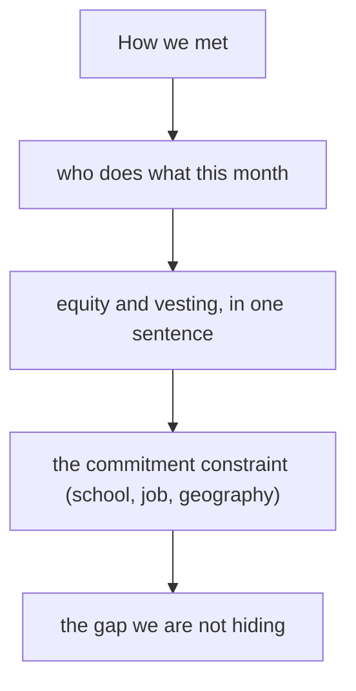

# 團隊、股權與角色
{: .no_toc }

*約 8 分鐘*

**面試偶爾會問**

## 為什麼重要

團隊問題在有東西看起來不對時會變尖：單獨創辦人、90/10 的分配、共同創辦人不在房間裡、一個學生團隊說不出五月會發生什麼。團隊看起來正常時，這是幾個問題，然後他們就走向用戶。這一頁是那些問題。它不是股票、SAFE 或創辦人協議的法律指南。文件去找律師。

## 核心概念

- **你們怎麼認識，以及實際一起做了多久。** 上個月才開始的同學，和一起出貨兩年的前同事，是不同的風險。講真的版本。YC 公開的申請建議把「共同創辦人沒出現在創辦人影片裡」當成一個訊號。如果有人缺席，在他們問之前解釋。
- **角色是這個月的工作，不是頭銜。** 誰跟用戶談、誰出貨、誰擁有他們會問的那個數字。「我們兩個什麼都做」、沒有擁有者，代表沒有人擁有那個不舒服的任務。兩人團隊重疊很正常。缺掉的功能（沒有人做得出來、沒有人願意賣）才是要指名、並處理的東西。
- **股權：慷慨、有 vesting，而且不是點子的獎品。** Michael Seibel 的 Startup School 課是給 VC 形狀的早期新創的標準建議：對共同創辦人的股權慷慨，當每個人都必要而且全職時，偏好接近對等，並把創辦人放在四年 vesting、一年 cliff。因為「點子是我的」而 90/10，是常見的分手配方。貢獻真的不對等時，非常不平均可以沒問題。準備好不退縮地解釋。
- **單獨創辦人。** 這樣說。然後說產品怎麼被做出來、用戶怎麼被談到。一個拿 0.25% 的顧問不是共同創辦人。一個「看到 traction 之後也許會加入」的朋友是希望。有些公司單獨是對的。假裝不是，才是錯誤。
- **學生和兼職，包括 Penn。** 問題是承諾。現在每週幾小時。畢業或學期結束時什麼會變。兩個創辦人是不是都在。一個團隊這個夏天全職、八月回課堂，應該這樣說，並且說如果進了 batch，「在」是什麼意思。Partner 投過學生。他們也放過那些沒辦法從習題裡抬起頭的團隊。如果你不是全職，不要表演全職。
- **房間的差別。** YC 會戳分配、缺席的人、以及承諾，因為他們在很早的階段押的是創辦人。稍後到的 seed 基金仍然在乎，而且會更在乎 CEO 能不能找到接下來的兩個人。兩個房間都不是談判 cap table 的地方。如果分配是錯的，在面試之前跟共同創辦人把對話修掉，不要在面試裡修。

## 心智模型

短、具體、稍微不舒服，是對的語氣。一段文化演講不是。

## 面試問題

1. **你跟共同創辦人怎麼認識，誰做什麼？**
   答：真實的起點，和現在的工作分法。「我們在同一個研究計畫裡一年。她跑用戶對話和診所關係。我做產品。我們兩個都坐進跟第一家診所的每週通話。」如果他們問，頭銜可以跟在後面。工作先來。

2. **為什麼股權是 80/20？**
   答：一個真的理由，或把它改掉。真的理由聽起來像：「她六個月後加入，到五月都是兼職，我們同意她全職之後，四年 vesting、一年 cliff，是 70/30。80/20 是舊數字，過時了。」「點子是我的」不是真的理由。Seibel 的課是：結果還未知時，慷慨的論點。

3. **你是單獨創辦人。為什麼我們該相信公司會被做出來？**
   答：你自己做得到什麼，以及具體的缺口。「我出得了貨，前 20 通用戶電話是我打的。我沒辦法一週三天在診所、同時做產品。這一輪之後我要找一個 founding generalist，在那之前，診所拜訪是我星期四自己去。」不要發明一個共同創辦人。

4. **你們都是大三。如果這件事成了，你還有一年學業，會怎樣？**
   答：實際的計畫。「如果我們進去了、用戶也是真的，我們會休學一年。我們跟父母談過，也看過休學。如果不休，我們就維持晚上做，而且故意讓它保持小。」沒想過的「我們兩個都做」是弱的版本。想清楚的限制沒問題。

## 觀看

- [Co-Founder Equity Mistakes to Avoid | Startup School](https://www.youtube.com/watch?v=DISocTmEwiI) — Y Combinator，Michael Seibel。慷慨、vesting、cliff，以及分配傾斜的壞理由。這是給早期科技新創的建議，不是律師的替代。

## 延伸閱讀

- [Co-Founder Equity Mistakes to Avoid](https://www.ycombinator.com/library/LP-co-founder-equity-mistakes-to-avoid) — 同一堂 Seibel 的課，在 YC library。
- [How to find the right co-founder](https://www.ycombinator.com/library/8h-how-to-find-the-right-co-founder) — YC Startup Library。
- [The Equity Equation](https://paulgraham.com/equity.html) — Paul Graham。怎麼想，把股權給一個實際會貢獻的人。
- [Founder Mode](https://paulgraham.com/foundermode.html) — Paul Graham。比這場面試更後面，當 partner 問創辦人會不會留在工作旁邊時有用。
