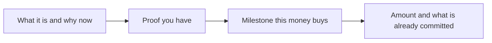

# 募資敘事與 ask
{: .no_toc }

*約 9 分鐘*

**🎯 面試高頻**

## 為什麼重要

公司的故事和 the ask 是不同的技能，創辦人把它們混成一段估值演講。敘事是為什麼這家公司該存在、你有什麼證據。Ask 是你在募多少、錢用完時什麼必須是真的、以及已經承諾了什麼。如果你在募，YC 會問短版。一場 seed meeting 常常就決定在這上面。這一頁停在面試的高度。Term sheet、SAFE 條款、以及「用哪一份文件」是律師的工作，不在這裡的範圍。

## 核心概念

- **敘事的順序。** 你做什麼（兩句話和一個例子）。給誰、為什麼是現在。你實際有的證據（一個客戶故事、一個有定義的指標）。為什麼是這個團隊。然後 the ask。在他們知道你做什麼之前就講生平、導覽技術、放一張市場投影片，是好公司聽起來很混亂的方式。Seibel 的 seed pitch 談話是清單：你做什麼、團隊、traction、insight、市場、ask。
- **Ask 是一個金額、一個用途、和一個里程碑。** 「我們在募 $1.5M。它付我們兩個和一個聘僱大約 18 個月，里程碑是診所在我們已經跑過的動作上做到 $25k MRR，不是一個新市場。」Runway 是限制。里程碑是重點。單獨「18 個月的 runway」是 burn 的描述。
- **資金用途是兩到三個結果。** 做出擋住下一批買家的那個東西。把指標做到你指名的水位。做一個你描述得出工作內容的聘僱。一張房租和「緩衝」的圓餅圖不是資金用途。
- **這一輪的狀態，不要劇場。** 誰承諾了、有沒有 lead、是不是才剛開始。「我們沒有 lead；我們在第一輪會議」是好句子。「我們星期五要關」而你並沒有，是陷阱。見[常見陷阱](../12-common-traps-weak-answers/)。
- **估值不是里程碑。** YC 自己的基本建議寫著，估值不是成功，而且他們一些最有名的公司早期是以謙遜的價格募到的。如果你不知道工具，不要在房間裡發明一個 cap。「我們用 SAFE 募，還沒設 cap；我們比較想等你想投之後再談」比一個一小時前編出來的數字更可信。知道你實際在哪一個流程裡。文件本身不在這份指南的範圍。
- **房間的差別。** 在 YC 面試，ask 常常是三個問題：你在不在募、多少、錢拿去做什麼。他們不是在那裡談你的 cap。在 seed 的合夥會議，ask 就是決定。帶上會讓下一輪（或獲利）變成另一種對話的里程碑，不要把會議花在可比公司上。

## 心智模型

如果你指不出里程碑，金額就是猜的。

## 面試問題

1. **你在募多少，錢要做什麼？**
   答：金額、時間、結果。「$1.5M，大約 18 個月，兩個創辦人加一個 generalist。結果是十家付費診所，prior-auth 工作流程每週被用，那是我們用手做過一次的動作。」如果你不在募，這樣說，並說什麼會讓你開始募。

2. **你的估值是多少？**
   答：不要發明一個。如果你有流程，平白描述。「我們還沒設 cap。如果做 SAFE，會等 lead 認真時再設。」如果你已經簽了條件，可以說形狀。一段可比公司的獨白，在這個階段不是估值辯護。價格不是成就。YC 的基本新創建議直接這樣說，並指向 Seibel：募資輪次不是里程碑。

3. **這一輪還有誰？**
   答：真話，包括你可以說的名字，以及真正承諾的金額。「兩個天使，$150k 簽了，還沒有基金 lead。我在跟你和另外兩家基金談。」軟性的圈、和「他們很興奮」，不算在裡面。誇大承諾會在盡職調查被發現，然後流程結束。

4. **為什麼要募？你有營收。**
   答：你在現在的 burn 上到不了的里程碑，以及為什麼那個里程碑重要。「我們在 $7k MRR，founder-sold。募資是為了讓我不再是診所通話上唯一的人，並看那封信沒有我行不行。如果不行，我們不該再往下聘。」因為募資感覺像進展所以去募，是 YC 自己「募資不是工作」那則建議裡的失敗模式。

5. **用兩分鐘把故事走一遍。**
   答：照上面的順序，落在 ask。用計時器大聲練。如果你超過兩分鐘，你放進了架構或童年。那些先砍。

## 觀看

- [How To Perfectly Pitch Your Seed Stage Startup With Y Combinator's Michael Seibel](https://www.youtube.com/watch?v=lw2X3PxKlAY) — SaaStr。Seed pitch 的元素：你做什麼、團隊、traction、insight、市場、ask。對象是還沒有 product-market fit 的公司，高度是對的。
- [How Pitching Investors is Different Than Pitching Customers - Michael Seibel](https://www.youtube.com/watch?v=pQnOBHNKlgs) — Y Combinator。為什麼對投資人的語言必須具體、沒有行話。那是募資的敘事那一半。

## 延伸閱讀

- [A guide to seed fundraising](https://www.ycombinator.com/library/4A-a-guide-to-seed-fundraising) — Geoff Ralston，YC Startup Library。實務的 seed 指南：為什麼、何時、怎麼做，而不把它變成法律手冊。
- [How startup fundraising works](https://www.ycombinator.com/library/Il-how-startup-fundraising-works) — Brad Flora，YC Startup Library。去神話的版本：會議，不是神話。
- [How to Raise Money](https://paulgraham.com/fr.html) — Paul Graham。
- [A Fundraising Survival Guide](https://paulgraham.com/fundraising.html) — Paul Graham。一輪募資的情緒形狀。在你帶著防衛走進之前有用。
- [Writing a Business Plan](https://www.sequoiacap.com/article/writing-a-business-plan/) — Sequoia Capital。敘事的清單。Ask 仍然必須是你的。
