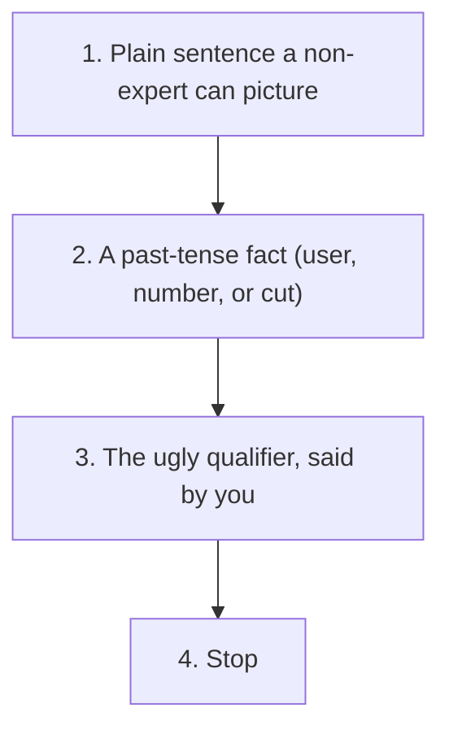

# 常見陷阱與弱回答
{: .no_toc }

*約 8 分鐘*

**🎯 面試高頻**

## 為什麼重要

多數失敗的創辦人面試，不是缺一個秘密框架。它們死在一句話：一個行話名詞、一個未來式的計畫、一個建在四個客戶上的精確比率，或一個壞事實被塞在一個比較好聽的詞下面。這一頁是 partner 會戳的清單。讀完主軸之後再讀它，然後在你自己的 mock 裡聽這些。見 [Mock Q packs](../13-mock-q-packs/)。

## 核心概念

- **行銷語言。** 「平台」、「AI-powered」、「某某的作業系統」、沒有機制的「Uber for X」。Seibel 的對照是對的測試：「組織全世界的資訊」對外行人什麼都沒說；一個人、一個查詢、一列連結才有。「如果你主修以外的聰明朋友沒辦法複述你做什麼，把句子重寫。」見[產品判斷](../04-product-sense-prioritization/)。
- **全是未來，沒有過去。** 「我們會去跟用戶談。我們會上線。我們會擴張。」強的時態是過去：我們跟這些人談了、我們出了這個、他們做了這個。未來可以用在計畫上。它不能是全部的答案。
- **TAM 劇場和假精確。** 一個由上往下的數十億，或「LTV/CAC 4.7」、沒有付費獲客、也沒有生命週期。你導得出來的範圍，打贏你導不出來的小數。見[市場規模](../05-market-size-wedge/)和 [Traction](../07-traction-metrics-under-fire/)。
- **「沒有競爭者」，以及滿格的勾選矩陣。** 兩者都在躲現狀。講他們今天用誰。見[競爭](../06-competition-differentiation/)。
- **熱情、願景、和出場投影片。** 在乎不是證據。收購者不是策略。Dalton 和 Michael「不要像投資人那樣想」的對話就是這個：市場地圖、出場投影片、一份完全做完的計畫，是創辦人用來避開用戶的方式。
- **把壞事實藏起來。** Churn、離開的共同創辦人、沒轉成付費的 pilot、一個含了一次性費用的數字。在講好聽數字的同一口氣裡說出來。短的房間會用算術找到。盡職調查會晚一點找到，然後問題變成信任。
- **沒有新事實的 tarpit 點子。** 一個熟悉的學生點子（「一個決定週五晚上的 app」），幾百個人試過。你仍然可以做一個擁擠的問題。你需要一個理由，這一次不一樣，而且來自一個你描述得出來的用戶。「我們現在用 AI」不是那個理由。
- **長度。** 在大約 10 分鐘的 YC 面試裡，用 90 秒回答一個 10 秒的問題，是你讓他們沒問到後面那些問題的方式。回答，停，讓他們拉。Seed meeting 原諒更多長度，仍然會注意到你不能簡潔。

## 心智模型

如果你的答案跳過 2，它是 pitch。如果跳過 3，它是包裝。如果跳過 4，它是獨白。

## 面試問題

1. **「你們做什麼？」的弱回答是什麼，怎麼修？**
   答：弱：「我們在做一個 AI-powered 平台，革新 SMB 的營運。」修：「我們把診所的 prior-auth PDF 變成一份送出的表單。一家四個醫生的診所，行政上星期二在這件事上花了四小時。她一個月付 $200。」同一家公司。第二個可以被質問。那是你要的。

2. **你上個月成長 50%。弱的說法是什麼，強的說法是什麼？**
   答：弱：「我們月對月成長 50%。」強：「MRR 從 $4k 到 $6k。$6k 裡的 $1k 是設定費，所以重複的是從 $4k 到 $5k。四個客戶裡有一個是六月結束的 pilot。」你仍然成長了。你也仍然值得信任。

3. **他們問競爭者，你說「沒有人在做完全一樣的事。」他們聽到什麼，你改說什麼？**
   答：他們聽到你沒看過替代做法。改說：用戶今天用誰、那在哪裡斷、以及如果你不在房間裡，他們會提到的那家新創或現有廠商。

4. **一個創辦人在像投資人那樣想，破綻是什麼？**
   答：計畫是關於這一輪、收購者、或市場地圖，用戶是抽象的。修法是回到一個人，和上一次。YC 關於這件事的對話說得很明確：在他們投資的階段，做完的出場不是重點。見 [Why this / why now / why you](../02-why-this-why-now-why-you/)。

5. **你答到一半發現自己誇大了一個數字。你怎麼做？**
   答：下一句就改。「我說十個付費。是七個付費，三個沒付費的 pilot。」在他們拿某個東西去除之前做。自己抓到是正面訊號。等著被抓到不是。

## 觀看

- [How Pitching Investors is Different Than Pitching Customers - Michael Seibel](https://www.youtube.com/watch?v=pQnOBHNKlgs) — Y Combinator。行話和行銷語言，以及為什麼它們在業務電話上有用，對投資人卻失敗。
- [Successful Founders Are OK With Rejection – Dalton Caldwell and Michael Seibel](https://www.youtube.com/watch?v=zB_SkaERWZY) — Y Combinator。用不去跟用戶談來保護自尊的陷阱。它在面試裡出現的方式，是一個未來式的客戶故事。

## 延伸閱讀

- [Why Founders Shouldn't Think Like Investors](https://www.ycombinator.com/library/Kk-why-founders-shouldn-t-think-like-investors) — Dalton Caldwell 與 Michael Seibel，YC Startup Library。
- [What Startups Are Really Like](https://paulgraham.com/really.html) — Paul Graham。工作實際感覺的目錄。當一個答案開始表演你沒有的確定時有用。
- [Before the Startup](https://paulgraham.com/before.html) — Paul Graham。從問題開始，而不是從「當創辦人」這個點子開始。
