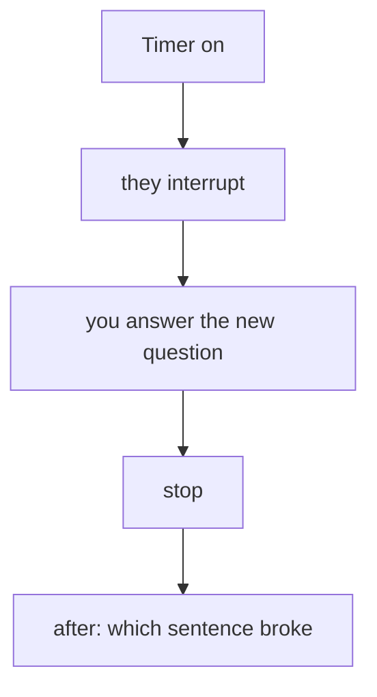

# Mock Q packs（高頻題）
{: .no_toc }

*約 9 分鐘*

**🎯 面試高頻**

## 為什麼重要

讀主軸，和大聲回答，是不同的技能。創辦人面試很短、會被打斷、而且對背稿過敏。這一頁是練習：一組 YC 風格，一組早期 VC，帶著好答案的形狀，以及指向放著內容的那一頁。跟一個願意把你切斷的共同創辦人或朋友跑。

## 核心概念

- **怎麼跑。** Pack A 十分鐘。一個人問，而且必須至少打斷三次。錄下來。唯一重要的檢討：哪一句破了（行話、沒有用戶、一個你定義不了的數字、一個長過問題該有的答案）。把那句修好，再跑一次。不要加投影片。
- **Pack B 是三十分鐘。** 兩分鐘敘事，然後問題。問的人應該要一個定義，以及一個叫得出名字或情境的客戶。同樣方式檢討，再加上：ask 有沒有落在一個里程碑上？
- **每次的答案形狀。** 白話句子。過去式的事實。難看的限定，由你自己說。停。內容在前面的主題裡。如果你靠有魅力、又模糊而「贏」了 mock，mock 就失敗了。
- **不要背段落。** 背事實（用戶、數字、砍掉的東西、價格、分配）和順序。Partner 聽得出背出來的答案，一次打斷就把它毀掉。
- **換邊。** 只問問題的人，聽不到自己的閃躲。兩個創辦人都要答得了。YC 面試可以把下一題指向你們任何一個。

## 心智模型

你在回想一個真數字時的沉默，好過一句你之後必須收回的順句。

## 面試問題

Pack A 是 YC 風格的十分鐘。Pack B 是 seed 風格的後續。答題方向是形狀，不是稿。

1. **Pack A — 你們做什麼？**
   答：外行人想得到畫面的兩句話，加上場景裡的一個人。沒有類別名詞。完整版：[產品判斷](../04-product-sense-prioritization/)和[陷阱](../12-common-traps-weak-answers/)。

2. **Pack A — 用戶是誰？跟我講最後一個。**
   答：角色和情境、問題上次發生是什麼時候、替代做法、代價、以及你改了什麼。如果你只有朋友，這樣說。完整版：[問題清晰度](../03-problem-clarity-customer-stories/)。

3. **Pack A — 你怎麼賺錢，數字是什麼？**
   答：誰付、多少、多久一次。然後真正的 traction 句子：絕對水位、日期、以及品質標籤（付費、pilot、LOI）。完整版：[定價](../09-business-model-pricing/)和 [Traction](../07-traction-metrics-under-fire/)。

4. **Pack A — Why you，以及 why now？**
   答：一個是事實的優勢，以及一個讓產品在今年成為可能的變化。「我們在乎」和「AI 很熱」不算。完整版：[Why this / why now / why you](../02-why-this-why-now-why-you/)。

5. **Pack A — 如果有在募，你在募什麼，錢做什麼？團隊上還有誰？**
   答：金額、里程碑、承諾的限制（包括學校）。只有他們戳到一個怪的分配時才談股權。完整版：[募資](../11-fundraising-narrative-ask/)和[團隊](../10-team-equity-roles/)。

6. **Pack B — 走一遍 wedge，然後更大的市場。哪裡還沒被證明？**
   答：第一批買家的由下往上計數、一個相鄰步驟，以及你還沒賣到的那一步上的明確標籤。完整版：[市場規模與 wedge](../05-market-size-wedge/)。

7. **Pack B — 你今天輸給誰，為什麼現有廠商不複製你？**
   答：現狀加上一個指名的替代方案。一個用戶看得到的軸。一個結構性理由，或誠實的領先，不是一個你沒有的護城河。完整版：[競爭](../06-competition-differentiation/)。

8. **Pack B — 定義指標。秀一個 cohort。你花了什麼才拿到他們？**
   答：定義、絕對數字、cohort，以及如果你沒有為通路付過錢，就說「創辦人的時間」。跟問的人一起重算成長率。完整版：[Traction](../07-traction-metrics-under-fire/)和 [Go-to-market](../08-go-to-market-story/)。

9. **Pack B — 兩分鐘的故事，然後：十八個月後什麼必須是真的，這一輪才是對的？**
   答：敘事順序，然後一個陌生人核對得了的里程碑。不是估值。完整版：[募資](../11-fundraising-narrative-ask/)。

## 觀看

- [How to Apply and Succeed at Y Combinator by Dalton Caldwell](https://www.youtube.com/watch?v=8yiOcCPvyNE) — Y Combinator。短面試是幹嘛的。跑 Pack A 之前看，讓打斷感覺正常。
- [Live Office Hours with Kevin Hale and Dalton Caldwell - Stanford CS183F: Startup School](https://www.youtube.com/watch?v=8Qc8ipjzatY) — Stanford Online。較早的 office hours（2017）。看提問的方式：他們打斷、追一個模糊的用戶、不讓 pitch 跑完。公司過時了。模式沒有。

## 延伸閱讀

- 這份指南，主題 [02](../02-why-this-why-now-why-you/) 到 [12](../12-common-traps-weak-answers/)。這兩組題就是那些頁面，排成面試順序。
- [How To Perfectly Pitch Your Seed Stage Startup With Y Combinator's Michael Seibel](https://www.youtube.com/watch?v=lw2X3PxKlAY) — SaaStr。Pack B 開場的兩分鐘骨架。
- [YC's essential startup advice](https://www.ycombinator.com/library/4D-yc-s-essential-startup-advice) — Geoff Ralston 與 Michael Seibel。兩次 mock 之間，時間該花在什麼上的短清單。
